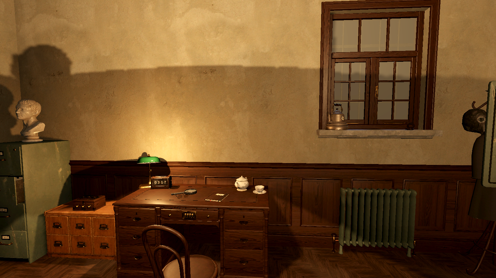

# MYSTERY ROOM — The Forgotten Institute

An original premium 3D mystery escape-room game for Android and iOS, built with **Godot 4.7.2**.
Languages: **English · Русский · Oʻzbekcha** (Latin).

> 14 November 1979: every clock in the Meridian Institute stopped at 03:17, and forty-one scientists vanished.
> Decades later a parcel brings you an old lab badge and one line: *"Laboratory 7. Please finish what I could not."*



## What's here
| Area | Where |
|---|---|
| Godot project (game) | `game/` (main scene `src/ui/boot.tscn`, Chapter 1 scene `src/rooms/lab7/lab7.tscn`) |
| Pure puzzle logic + solver-backed tests | `game/src/rooms/lab7/lab7_logic.gd`, `game/tests/` |
| Story, puzzle graph, art direction, signature mechanics | `docs/STORY.md`, `docs/PUZZLE_DESIGN.md`, `docs/ART_DIRECTION.md`, `docs/DESIGN_PILLARS.md` |
| Procedural Blender models (Python) | `tools/blender/` (GLBs land in `game/assets/models/`) |
| CC0 textures/props, OFL fonts, synthesized audio | `tools/textures/`, `tools/models_cc0/`, `tools/fonts/`, `tools/audio/`; licences in `docs/ASSET_LICENSES.md` |
| Localization (EN → RU → UZ) | `tools/localization/*.py` → `game/localization/strings.csv` |
| QA renders | `docs/previews/`, `qa/blender/` |
| Release pipeline, monetization, store texts | `docs/RELEASE_PIPELINE.md`, `docs/MONETIZATION.md`, `docs/STORE_LISTING.md` |
| Testing on a phone (builds, checklist) | `docs/TESTING_ON_DEVICE.md` |
| Status / next steps | `DEVELOPMENT_STATUS.md`, `NEXT_STEPS.md` |

## Quick start (Linux)
```bash
tools/setup_env.sh                 # Godot 4.7.2, Blender 5.2.2 LTS, export templates, lavapipe, Inkscape, SoX
tools/run_tests.sh                 # headless tests (logic, no-softlock fuzz, saves, localization, layout)
godot --path game                  # play (desktop; mouse emulates touch)
# Runtime QA in the real 3D scene (software Vulkan under Xvfb):
xvfb-run godot --path game res://qa/playthrough.tscn -- --out=/tmp/pt
# Android debug APK (needs the Android SDK and ~/.config/godot editor settings):
cd game && godot --headless --export-debug "Android" ../build/android/mystery-room-debug.apk
```

## Chapter 1 — The Locked Laboratory
- 12 linked puzzles in about 20–30 minutes.
- Mechanics: UV ink, a cipher, mechanisms, circuits, a radio beacon, a secret bookcase door, a shadow lock, **Light Memory** (record a shadow into a crystal), and steering a live **Lumen beam** with mirrors.
- A finale choice and optional Lumen shards, both carried into Chapter 2.

Chapters 1 and 2 are free. One fair purchase (`full_game`, US$4.99) unlocks Chapters 3 and 4: no ads, no energy, no subscriptions. Real payments stay disabled until the stores are configured.
