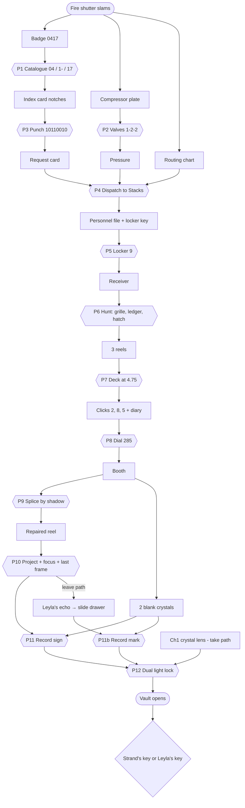

# Chapter 2 — The Missing Scientist (Records Archive B)

**Status:** full design (authoritative). Implementation: `game/src/rooms/archive/`.
**Target:** 30–40 minutes for a first-time player. 12 linked puzzles that grow steadily harder, a finale choice, and optional content.
**Design rules:** the same as Chapter 1 (`docs/PUZZLE_DESIGN.md`):
- every answer comes from in-world evidence;
- every solution is language-neutral;
- items are never lost;
- every mechanism is reversible;
- there are parallel branches;
- every goal has a three-level hint ladder.

## Story
After Chapter 1 the door of Laboratory 7 opens onto a dark corridor. At its end is **Records Archive B**, the Institute's paper memory. As you step in, a fire shutter crashes down behind you; the Array's surge woke the old safety relays. You are locked in again.

The evidence wall in Chapter 1 showed a 1998 clipping: *"Former researcher seen at the sealed Institute."* Leyla came back. Between 1996 and 1998 she lived in secret in the archive. She recorded a voice diary on wire-recorder reels and hid each reel with a tiny beacon only her pocket receiver can hear. She sealed her own sign into the archive vault's light lock, beside Strand's mark, so that only someone who follows both of them can open it.

Inside the vault are her field kit and the two keys to the levels below. The last reel shows the 1979 staff photograph in the Array Hall: 41 silhouettes in the light, and a **42nd at the edge of the frame. It is Leyla, in 1998.** She went in after them.

### Text beats (canonical EN; RU/UZ live in `tools/localization/strings_ch2.py`)
| Key | Text |
|---|---|
| Intro 1 | Beyond Laboratory 7, a corridor leads to Records Archive B. |
| Intro 2 | Somewhere in here, Leyla left the rest of her trail. |
| Personnel file (Leyla's 1998 letter) | To whoever opens my file: I came back in 1996. The Institute is sealed, but the archive still breathes — the tubes, the lamps, the vault. I hid my voice where my receiver can hear it. Locker 9 keeps the receiver. — L.R. |
| Tape 1996 | Day one. The Array still hums beneath the floor. I will record what I find and hide each reel where only my receiver can hear it. |
| Tape 1997 | The static speaks names. Forty-one names. Strand did not lose them. He kept them. |
| Tape 1998 | My sign is sealed into the vault beside Strand's mark. My sign is on his old film. The booth answers to my reels, in the order I made them. If I do not come back, the way down is inside. |
| Film frames 1–5 | 1 "Meridian Institute, 1979. The Array Hall." · 2 "Professor Strand demonstrates light memory." · 3 "Forty-one of us. The whole staff." · 4 "Dr. Rahimova draws her sign on the light glass." · 5 (no caption: her sign alone, frozen) |
| Secret reel (Ch1 shards = 5) | 13 November 1979. Strand, alone: "If the Array keeps them, I will be with them. Forgive me, Leyla." |
| Vault reel | The Array Hall. Forty-one silhouettes in the light. And a forty-second at the edge of the frame: Leyla, 1998. |

## Signature mechanics (new in Chapter 2)
| # | Mechanic | Builds on | In this chapter |
|---|---|---|---|
| M1+ | **Light Memory II: overlay** | Ch1 recording | Two crystals, each holding one recorded image, are projected **at once** through the vault's dual light lock. Only the exact overlay (Strand's mark with Leyla's sign at the right angle and size) opens it |
| M5 | **Pneumatic post** | M4 cross-space causality | A punched request card travels through glass tubes across the ceiling to the closed stacks. What comes back depends on what you punched and where you sent it |
| M3+ | **Portable receiver (hot/cold)** | Ch1 radio | Leyla's pocket receiver shows signal strength per view. You walk the room by ear and needle to find three hidden reels |
| M6 | **Film as evidence** | — | Splice a torn reel by the length of the sundial's shadow (dawn to noon), project it, focus it and hold a frame |

## Consequences of Chapter 1
| Ch1 result (`profile.choices`) | Effect in Chapter 2 |
|---|---|
| `ch1_lens = take_lens` | You start with the **crystal lens**, which still holds the emblem recorded in Ch1. It serves as the left-port crystal, so you skip recording the emblem. While you hold any Lumen crystal, faint **echoes** become visible from the start |
| `ch1_lens = leave_lens`, or no Ch1 save | You left the lens for her, and **Leyla's echo appears in the booth** after the film. She walks to the slide cabinet and touches the drawer that holds Strand's emblem slide. You record the emblem yourself with the slide projector. This is one extra step, guided by the echo |
| `ch1_shards = 5` | After the main film the projector runs on into a **secret reel** (Strand's private film, 13 Nov 1979) |

## Room layout (Godot coordinates, metres; Y up, the camera's default view is −Z)
Interior x ∈ [−5, 5], z ∈ [−3.5, 3.5], floor y = 0, ceiling y = 3.6. Walls are 0.2 m thick, outside the interior box. Finish:
- linoleum-tile floor (dark green/cream checker, worn);
- painted plaster walls (pale institutional green to 1.4 m, cream above), with a dado line and baseboards;
- concrete columns;
- a ceiling with exposed glass/brass pneumatic tubes and two rows of enamel pendant lamps.

| Element | Position / extent | Faces | Notes |
|---|---|---|---|
| Fire shutter (entrance) | south wall opening x ∈ [2.9, 4.1], y ∈ [0, 2.3] | −Z | Corrugated steel shutter, down |
| **Vault door** | north wall, centre (1.5, 1.35, −3.5), Ø 1.9 m round door in a concrete frame | +Z | Dual light lock: ports left/right at ±0.55 m, glass disc Ø 0.5 at the centre |
| **Projection screen** | north wall, centre (−2.5, 1.9, −3.45), 2.4 × 1.6 | +Z | Brass **crystal socket** on the frame, bottom centre (−2.5, 1.02, −3.42) |
| **Projection booth** | enclosure x ∈ [−4.2, −1.0], z ∈ [2.0, 3.5], ceiling 2.8 | | Window (north face) x ∈ [−3.0, −2.2], y ∈ [2.0, 2.5]. Door (north face) x ∈ [−1.8, −1.0], with a **rotary-dial lock** |
| Card catalogue | west wall, back at x = −5.0, centre z = −1.2 | +X | 1.4 w × 1.3 h. 10 drawers labelled 00–09 |
| Vent grille (reel 1996) | west wall (−4.98, 2.55, 0.9), 0.6 × 0.35 | +X | 4 screws, swings open |
| Stacks island | double-sided shelving x ∈ [−0.9, 0.9], z ∈ [−0.6, 1.4], h 2.0 | | Archive boxes and ledgers. The **hollow ledger** (reel 1997) is on the south face, middle shelf |
| Tube station | east wall, back at x = 5.0, centre z = −1.4 | −X | Send port, receive tray, destination dial, send lever, blank-card tray. Glass tubes rise into the ceiling run toward the stacks |
| Routing chart | east wall (4.98, 1.75, −0.35) | −X | Pictogram chart: *request card → book (stacks)* |
| Compressor panel | east wall, centre (4.96, 1.3, 0.8) | −X | 3 valve wheels, 2 gauges, piping diagram plate |
| Archivist's desk | (2.9, 0, −2.4) | +Z | Card punch on top, tape deck beside it |
| Reading table | (1.9, 0, 1.0) | | Green banker's lamp |
| Floor hatch (reel 1998) | (0.9, 0, 2.5), 0.6 × 0.6 | | Ring pull |
| Lockers | south wall, x ∈ [−0.6, 1.8], back at z = 3.5 | −Z | 2 rows × 6, numbered 1–12 |
| Vault interior | x ∈ [0.6, 2.4], z ∈ [−5.2, −3.7] | | Shelves, field kit, key cradle (two keys), small projector |

## Acts & puzzles
| # | Act | Puzzle | Type | Evidence | Solution | Reward |
|---|---|---|---|---|---|---|
| P1 | A Records | **Card catalogue** | Observation | Leyla's badge shows staff no. **0417**. The drawers are labelled 00–09, by the first two digits | Open drawer **04**, then divider **1–**, then pull card **17** | Leyla's index card (edge-notched) |
| P2 | A | **Compressor** | Mechanical deduction | Two gauges (P, F) have green marks at **5** and **4**. The piping plate shows A→P single, A→F double, B→P double, C→F single | Valves **A = 1, B = 2, C = 2** (P = A + 2B, F = 2A + C, unique) | Tube pressure: the station lamp turns green |
| P3 | A | **Request card** | Copy a pattern | The index card has 8 edge positions, notched or not | Blank card into the punch; keys **1 0 1 1 0 0 1 0**; pull the lever | Punched request card |
| P4 | A | **Pneumatic dispatch** | Routing | The routing chart pairs a request card with the **book** symbol (stacks) | Card in the canister, dial on **book**, pull the lever (needs pressure) | The canister flies across the ceiling and returns with **Leyla's personnel file + locker key 9** |
| P5 | B Voices | **Locker 9** | Key | The key tag reads 9 | Locker key on locker 9 | Pocket receiver |
| P6 | B | **Receiver hunt** | Hot/cold exploration | The receiver's needle and beep rate rise near a hidden reel | Find reels behind the **vent grille**, in the **hollow ledger** and under the **floor hatch** | Tape reels 1996, 1997 and 1998 |
| P7 | B | **Tape deck** | Instrument setting | Every reel label says **4.75** (tape speed) | Speed selector on **4.75**, reel on the deck, Play. A wrong speed garbles the sound | Leyla's voice diary (captions). Each reel ends in clicks: **1996: 2, 1997: 8, 1998: 5** (VU needle and caption dots too) |
| P8 | C Booth | **Rotary-dial door** | Code from audio | Tape 1998: "the booth answers to my reels, in the order I made them" | Dial **2 8 5** | Booth opens |
| P9 | C | **Film splicing** | Sequencing | Four loose frames show the sundial obelisk with shadows of different lengths. The reel can's lid shows sunrise → high sun | Order by shadow, **longest to shortest**: frames f2, f0, f3, f1 (shadow lengths 4, 3, 2, 1) | Repaired reel |
| P10 | C | **Film projector** | Device + focus | — | Reel on the projector, pull the run lever. The film plays on the big screen. Turn the focus ring to sharp (**5** of 0–8). Step to the **last frame** (Leyla's sign) | The film is seen. Leave path: Leyla's echo appears |
| P11 | D Light | **Record the sign (M1)** | Recording | The screen frame has a brass crystal socket. "The crystal remembers what falls on it" | A **blank crystal** (booth lens case) in the screen socket while the sharp sign frame is shown **alone** | Crystal with Leyla's sign |
| P11b | D (leave path) | **Record Strand's mark** | Recording | Leyla's echo touches the ✦ drawer of the slide cabinet | Emblem slide into the **slide projector**. Turn it until the meridian stands upright (2 of 4 positions are right; the mark is symmetric). The film projector must be **off**. A second blank crystal in the socket | Crystal with Strand's mark |
| P12 | D | **Dual light lock (M1+)** | Spatial overlay | The vault's glass disc carries a faint engraving: the ring with the sign inside, on its side and smaller. Port plates show ✦ (left) and ☾ (right) | Mark crystal (crystal lens or recorded mark) in the **left** port, sign crystal in the **right** port. Left rotation upright (0 or 4 of 8), right rotation **2** of 8, right zoom **3** of 0–4 | Bolts retract. Turn the wheel 3 times and the vault opens |
| — | Finale | **Two keys** | Narrative choice | The vault reel shows the 42nd silhouette. Lifting one key locks the other | **Strand's key** (Array Hall) or **Leyla's key** (crystal vaults) | `choices.ch2_key`, the entry route in Chapter 3 |
| ★ | Optional | **Kept echoes 0/3** | Exploration | Visible only while you hold a Lumen crystal: an archivist at the catalogue, two scientists in the stacks, Strand in the booth | Tap each one to release it | Epilogue line and the "Echoes of the Archive" achievement |

### Data tables
**P2 gauges:** P = A + 2B, F = 2A + C, with valves in 0..4 starting at (0, 0, 0). Green marks are P = 5 and F = 4. A + 2B = 5 gives (1, 2) or (3, 1). 2A + C = 4 rules out A = 3, so the unique solution is (1, 2, 2).

**P3 punch pattern:** positions 1–8, notched = punched: `1 0 1 1 0 0 1 0`. Blank cards are unlimited in the tray. A wrongly punched card is returned with a red "file not found" slip.

**P4 destinations** (dial positions 0–5): 0 ✦ Director, 1 📖 Stacks, 2 ⚗ Laboratories, 3 🎞 Booth, 4 ✉ Records office, 5 🔒 Vault (sealed).
- The chart shows only "request card → 📖".
- Any other destination returns the canister with the card and a "no receiver" knock.

**P6 receiver strength** (0–5 bars) per view; the nearest unfound reel counts:
| View | vent (1996) | ledger (1997) | hatch (1998) |
|---|---|---|---|
| hall (root) | 1 | 2 | 2 |
| catalogue | 4 | 1 | 0 |
| grille | 5 | 0 | 0 |
| stacks | 1 | 4 | 2 |
| ledger | 0 | 5 | 1 |
| reading | 0 | 2 | 4 |
| hatch | 0 | 1 | 5 |
| other views | 0 | 0–1 | 0–1 |

**P7 speeds:** the selector has 2.4, 4.75, 9.5 and 19 cm/s and starts at 19. The labels say 4.75. The click counts are 1996 → 2, 1997 → 8, 1998 → 5.

**P9 frames:** shadow lengths f0 = 3, f1 = 1, f2 = 4, f3 = 2, so the correct slot order is f2, f0, f3, f1. A frame can be lifted from a slot back to the bench at any time.

**P10 projector:** frames 0–5 (0–4 story frames, 5 = sign alone). Focus is 0–8, starts at 1 and is sharp at 5. The run lever toggles the projector lamp. The first run plays the frames automatically, then holds frame 5. Frame step ◀ ▶ works while the lamp is on.

**P12 lock:** left rotation 0–7 starts at 2 (upright = 0 or 4). Right rotation 0–7 starts at 5 (target 2). Right zoom 0–4 starts at 0 (target 3). Ports accept only recorded crystals; a blank crystal shows nothing. The crystals can always be taken back out.

## Dependency graph

Parallel branches:
- P1 ∥ P2 (catalogue and compressor);
- P5–P7 can start as soon as the file arrives, while the punch is optional to redo;
- the take path skips P11b;
- the optional echoes can be found at any time once a crystal is held.

## Hint ladder
Each row shows level 1 (nudge), level 2 (where to look) and level 3 (answer).

| Goal | Condition | 1 | 2 | 3 |
|---|---|---|---|---|
| catalogue | no index card | Leyla's badge carries a number. | The catalogue drawers are numbered by the first two digits. | Drawer 04, divider 1–, card 17. |
| compressor | pressure off | The tube station is dead: no pressure. | The plate shows which valve feeds which gauge. Both needles need their green marks. | Valves: A 1, B 2, C 2. |
| punch | no request card | The stacks only answer punched requests. | Take a blank card from the station tray and copy the index card's notches with the punch. | Keys 1, 3, 4 and 7 down (1 0 1 1 0 0 1 0), then pull the lever. |
| dispatch | request card, file not delivered | Requests travel by tube. | The chart on the wall shows where request cards go. | Card in the canister, dial on the book, pull the lever. |
| locker | file, no receiver | Leyla's letter names a locker. | Her file held a small key with a tag. | Use the locker key on locker 9. |
| hunt | receiver, reels missing | Leyla hid her voice where her receiver can hear it. | Select the receiver and watch the needle as you look around. | Vent grille on the west wall, hollow ledger in the stacks, floor hatch near the reading table. |
| tape | reels, no clicks heard | The reels need a player. | The archivist's deck plays them; match the speed written on the reels. | Speed 4.75, put a reel on the deck, press Play. |
| booth | clicks heard, booth closed | The booth door has a dial. | "The booth answers to my reels, in the order I made them." Count each reel's clicks. | Dial 2, 8, 5. |
| splice | booth open, reel torn | The film is in pieces. | The lid shows the day running from dawn to noon. Shadows shorten. | Order the frames from the longest shadow to the shortest. |
| project | reel repaired, film not seen | Strand's film wants a projector. | Thread the reel and pull the run lever. | Use the reel on the projector, then pull the lever. |
| focus | film seen, not sharp | The picture is blurred. | Turn the projector's focus ring. | Focus to the middle mark (5). |
| record_sign | no sign crystal | "The crystal remembers what falls on it." | The screen frame has a socket for a crystal. Show only her sign, sharp. | Hold the last frame in focus and seat a blank crystal in the screen socket. |
| mark | leave path, no mark crystal | Leyla's echo pointed somewhere. | The slide cabinet: ✦. Use the slide projector, with the film projector off. | Emblem slide in the slide projector, turn the meridian upright, film lamp off, blank crystal in the socket. |
| ports | crystals ready, vault locked | The vault door has two lenses. | The plates show which mark goes where: ✦ left, ☾ right. | Mark crystal left, sign crystal right. |
| align | both ports filled | Match the faint engraving on the glass. | The mark stands upright; the sign lies on its side inside the ring, smaller. | Left upright, right turned 2 steps, zoom 3. |
| wheel | unlocked | The bolts are free. | Turn the wheel. | Tap the wheel three times. |
| finale | vault open | Two keys. You may take only one. | Strand's key opens the Array Hall; Leyla's opens the crystal vaults. | Choose. |

## Softlock analysis
- **Items:** never consumed by mistakes.
- **Blank request cards:** unlimited. A wrongly punched card is returned.
- **Mechanisms:** every one is reversible: valves, punch keys before the lever, dial input (resets after 3 digits), splicer slots, focus, frames, rotations, zoom and speed selector.
- **Crystals:** they can be taken out of sockets and ports. A recorded crystal never loses its image.
- **Re-recording:** a crystal that already holds an image cannot record another. The crystal lens is refused in the screen socket.
- **The leave path:** the slide cabinet stays openable after the echo, and the echo's hint stays in the hint ladder.
- **Fuzz:** random play over many seeds on both paths (take/leave) must always leave the solver able to finish.

## WOW moments (≈ every 3–5 min)
| Min | Moment |
|---|---|
| 0 | The fire shutter crashes down. Emergency lamps flicker on aisle by aisle, and dust hangs in the light |
| 5–7 | The compressor wheezes to life. The canister **shoots through the glass tubes across the ceiling** and thumps back with Leyla's file |
| 10–14 | The receiver crackles; you hunt by needle and beep. The grille swings open, the ledger is hollow, the hatch hides a reel |
| 14–17 | Leyla's voice diary: VU needles dance and her words appear (1996–98) |
| 18–22 | The booth opens. Splice the film, and the archive lights dim: **a 1979 film plays on the big screen**, the projector beam crossing the dusty air. 41 people. Leyla draws her sign |
| 22–24 | Leave path: **Leyla's echo walks through the booth** and touches a drawer. Take path: the lens hums and kept echoes flicker into view |
| 26–30 | Two Lumen beams meet on the vault glass. The overlay snaps into the engraving, the bolts cascade, and the 1.9 m door swings open |
| 30+ | The vault reel: 41 silhouettes and a **42nd**. Two keys. Choose |

## Models (see `docs/models/ch2.md` for names, pivots and IA parts)
room_archive, card_catalogue, tube_station, compressor_panel, archivist_desk, card_punch, tape_deck, lockers, stacks_shelving, floor_hatch, booth_door (rotary dial), film_splicer, film_projector, slide_projector, slide_cabinet, projection_screen, vault_door, vault_interior, and the items: leyla_badge, index_card, request_card, file_folder, locker_key, pocket_receiver, tape_reel, film_reel, lumen_crystal, glass_slide, key_strand, key_leyla. Echoes: echo_leyla_standing (pointing), echo_archivist, echo_scientists, echo_strand_standing (exists).

## Cliffhanger → Chapter 3
The chosen key decides where Chapter 3 begins:
- **Strand's key**: the transformer halls under the Array Hall.
- **Leyla's key**: the crystal-growth vaults.

Either way the epilogue ends: *"Somewhere below, a recorder clicks on."*
