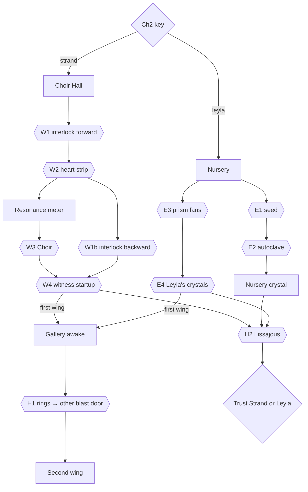

# Chapter 3 — The Underground Facility (Level −2)

**Status:** design draft. Implementation starts after Chapter 2 passes its 3D playthrough on both paths.
**Target:** 35–45 minutes for a first-time player. 11 linked puzzles, a finale choice, and optional echoes.
**Design rules:** the same as Chapters 1–2 (`docs/PUZZLE_DESIGN.md`):
- every answer comes from in-world evidence;
- every solution is language-neutral;
- items are never lost and every mechanism is reversible;
- there are parallel branches;
- every goal has a three-level hint ladder.

**New in this chapter:** the chapter is **not linear in space**. Your Chapter 2 key decides which wing you wake up in. You play both wings, in a different order, and meet a different person first.

## Story
The vault key from Chapter 2 opens the old freight lift under the archive. It goes down to Level −2, the machine floor that fed the Array. Three spaces meet here:
- **the Choir Hall**: Strand's wing, with transformers and a rack of brass resonance tubes, "the Choir";
- **the Nursery**: Leyla's wing, where the Array's crystals were grown;
- **the Resonance Gallery** between them: a round gallery around a shaft. Through its glass floor you see the Array itself, a ring of light thirty metres below.

The Chapter 2 epilogue ended with *"Somewhere below, a recorder clicks on."* That recorder is in Leyla's 1998 camp in the Nursery. Strand's office in the Choir Hall holds the other half of the truth: his diagnosis, and why he wanted to *keep* his colleagues rather than lose them.

At the end both of them are waiting in the light. Strand asks you to finish what he began: keep everyone, safely, forever. Leyla asks you to let them go. **Whom do you trust?**

### Text beats (canonical EN; RU/UZ go in `tools/localization/strings_ch3.py`)
| Key | Text |
|---|---|
| Intro (Strand's key) | The freight lift sinks below the archive. The tag on Strand's key reads: "For the Choir." |
| Intro (Leyla's key) | The freight lift sinks below the archive. The tag on Leyla's key reads: "For the Nursery." |
| Strand's diagnosis letter (1977) | "Two years, perhaps three. The Array does not forget, Leyla. Neither will I." |
| Strand's note (office) | "My heart keeps the count." |
| Leyla's recorder (1998) | "If you hear this, the lift still works. The Choir and the Nursery must sing together, or the Array stays deaf. I am going down to them. Listen to my crystals — they remember the tune." |
| Gallery plate | (pictogram only: the 3:2 figure) |
| Finale prompt | Strand holds out his tuning fork. Leyla holds out her crystal. Only one can be placed. |
| Epilogue (trust Strand) | The Array hums a single held note. Below, forty-one lights stop circling and wait. |
| Epilogue (trust Leyla) | The Array's note begins to fall, slowly, like a breath let out. Below, a forty-second light turns toward you. |

## Signature mechanics (new in Chapter 3)
| # | Mechanic | Builds on | In this chapter |
|---|---|---|---|
| M7 | **Witness echoes** | Ch1–2 echoes | A moment of 1979 is kept in the hall's crystal inspection ports. Each port sees it from one angle, and part of the action is hidden from each. Combine the views to rebuild the full sequence |
| M8 | **Resonance meter** | Ch1 radio, Ch2 receiver | Strand's handheld meter. Point it at an object, tap the object, and the needle reads its natural resonance (1–7) while it rings |
| M9 | **Crystal growth** | Ch1–2 crystals | Choose a seed and programme the autoclave's three growth stages. A clear crystal grows in eight seconds behind the window. A wrong programme grows a cloudy one, which can be remelted |
| M10 | **Prism fans** | Ch1 beam | Two prisms throw rainbow fans onto a seal. Colours add where the fans overlap. Every band also carries a shape (▲ red, ● green, ■ blue) so colour is never the only cue |
| M11 | **Lissajous lock** | — | Two frequencies draw a live figure on an oscilloscope. Match the figure engraved on Strand's plate |
| M12 | **Trapped-key interlock** | — | Real industrial safety logic. A key turned in an isolator becomes trapped and frees the next key. The chain runs forward to open Strand's office, then backward to make the hall safe to start |

## Consequences of earlier chapters
| Earlier result (`profile.choices`) | Effect in Chapter 3 |
|---|---|
| `ch2_key = strand_key` | You arrive in the **Choir Hall**. Strand's office (W2) is your first story room. The Nursery is sealed until the Gallery opens it |
| `ch2_key = leyla_key` | You arrive in the **Nursery**. The recorder clicks on as you enter Leyla's camp. The Choir Hall is sealed until the Gallery opens it |
| `ch1_lens = take_lens` | Four **kept echoes** are visible while you hold a crystal: a welder at the transformers, two technicians at the autoclaves, Strand at the gallery rail. Releasing them is optional (0/4) |
| `ch1_lens = leave_lens` | **Leyla's echo appears once** at the seed library and touches the right drawer, which makes E1 easier. Kept echoes still exist but only show through the inspection ports |
| `ch1_shards = 5` and `ch2_echoes = 3` | **Secret:** the 42nd socket on the memorial wall glows. Placing the Nursery crystal there for a moment plays a short echo of Leyla in 1998 (an epilogue line and a Chapter 4 true-ending flag) |

## Space (Level −2; Godot metres, Y up)
One scene in three zones along the X axis. Zones that are not in view are culled, as the Chapter 2 booth is.

| Zone | Extent | Contents |
|---|---|---|
| **Freight lift** | south of the Gallery, cage at (0, 0, 6) | Two gates: west (Strand's key) and east (Leyla's key). Each opens a short ramp into its wing |
| **Choir Hall (west)** | x ∈ [−13, −4], z ∈ [−4, 4], ceiling 6 m | 3 transformers with Jacob's-ladder spark gaps, **the Choir** (rack of 7 brass tubes on the north wall), the **switch room** (3 isolator cabinets), the **control desk** (5 levers, step counter, master knob), **Strand's glass office** (south-west), 3 **crystal inspection ports** (east wall low, west catwalk, ceiling gantry) |
| **Resonance Gallery (hub)** | circle r = 4.5 around (0, 0, 0) | Glass floor window over the shaft (Ø 3 m) with the Array far below. **Memorial wall**: 41 small crystals and an empty 42nd socket. Central **console**: master cradle, oscilloscope, two frequency knobs. Blast doors west and east, each with its own drum lock |
| **Nursery (east)** | x ∈ [4, 13], z ∈ [−4, 4], ceiling 4 m | 4 autoclaves (one working), **seed library** (12 drawers), growth-curve wall chart, **prism bench** in front of **Leyla's camp door** (spectral seal), **Leyla's camp** (cot, battery rig, recorder, oscillograph, 4 tuning crystals in the shutter frame to the Gallery) |

## Acts & puzzles
The wing order depends on `ch2_key`. Within a wing the order is fixed by evidence, not by locks. Both wings are fully self-contained until the Gallery.

### Choir Hall — Strand's wing
| # | Puzzle | Type | Evidence | Solution | Reward |
|---|---|---|---|---|---|
| W1 | **Interlock, forward** | Logic chain (M12) | Enamel plate in the switch room: ◆ → ▲ → ● → ■ → office door, with the rule "key in, turn OFF, next key free" in pictograms. Each cabinet's lock face shows the shape it takes; its glass window shows the key it holds | ◆ (on the control desk hook) into cabinet II, turn OFF → ▲ free. ▲ into cabinet I → ● free. ● into cabinet III → ■ free. ■ opens the office | Strand's office |
| W2 | **The heart strip** | Count + lock | Strand's ECG strip on the office lamp has three pen brackets marked ☼ ☾ ✦. His note: "My heart keeps the count." The meter case has three wheels marked ☼ ☾ ✦ | Count the heartbeat peaks inside each bracket: ☼ 4, ☾ 2, ✦ 6 | **Resonance meter**, Strand's letters |
| W3 | **The Choir** | Measure + order (M8) | The chalk "staircase" over the rack: 7 dots at heights 4 6 2 7 1 5 3 on a 7-line grid. 4 tubes hang, 2 of them in the wrong slots; 3 lie on the bench. Longer tubes ring lower | With the meter, read each tube (1–7) and hang slot k with the tube whose reading equals dot k's height. Strike the master hammer: a clean chord | Choir tuned |
| W1b | **Interlock, backward** | Logic chain (M12) | The control desk is dead while any isolator is OFF. The same plate, read backwards. The office key is trapped while the office door is open | Close the office door → ■ free. ■ into III, turn ON → ● free. ● into I → ▲. ▲ into II → ◆ free. All isolators ON | Desk live |
| W4 | **Witness startup** | Multi-view reconstruction (M7) | Three crystal ports each show the 1979 operator's echo starting the hall, in a loop. The desk's big step counter (1–5) is visible from every port. Port A (east, low) sees levers 1–2, port B (catwalk) sees levers 3–4, port C (gantry) sees lever 5 and the master knob | A: counter 2 → lever 2, counter 4 → lever 1. B: counter 1 → lever 4, counter 5 → lever 3. C: counter 3 → lever 5, then the knob to ●. Sequence **4 2 5 1 3**, then the knob | The hall starts: Choir chord, transformers hum, spark gaps climb. First wing: the west blast door opens. Second wing: power reaches the Gallery console |

### Nursery — Leyla's wing
| # | Puzzle | Type | Evidence | Solution | Reward |
|---|---|---|---|---|---|
| E1 | **Seed library** | Mental rotation | Leyla's growth log on the working autoclave shows her last seed's cross-section, sketched turned by a third of a turn. 12 drawers carry lattice glyphs; distractors differ by one notch | The drawer whose glyph equals the sketch turned back 120° | The right seed (any seed can be taken and returned) |
| E2 | **Autoclave programme** | Graph → mechanism (M9) | The wall chart: Leyla's growth curve with three plateaus at grid heights 5, 2, 4 on a 6-line grid. The cam drum has three stage pegs, 1–6 | Seed in the chamber, pegs 5-2-4, close, pull the start lever. A clear crystal grows in the window | **Nursery crystal**. A wrong seed or programme grows a cloudy crystal; "remelt" returns the seed |
| E3 | **Prism fans** | Additive light (M10) | The camp door's spectral seal has three receptors. Their rims show yellow ▲●, yellow ▲●, blue ■. Two prism turntables (P, Q) each throw a three-band fan (P: ▲ ● ■ left to right; Q mirrored), with 5 positions each | P centred and Q one step left: the receptors get ▲● / ▲● / ■. The solution is unique among the 25 combinations; the start (P and Q at the far right) lights only one receptor | Leyla's camp opens |
| E4 | **Leyla's crystals** | Melody, by ear or by eye | The recorder clicks on: her 1998 entry ends with four notes as she taps her tuning crystals. Her oscillograph shows each note's waveform; denser waves mean higher notes. The four crystals in the shutter frame differ in size, and each shows its waveform when tapped | Tap the crystals in the melody's order (3 1 4 2 by size, smallest = 1). Rewind replays the tape | The shutter to the Gallery opens. First wing: the Gallery wakes. Second wing: the Nursery's light reaches the console |

### Resonance Gallery — the hub
| # | Puzzle | Type | Evidence | Solution | Reward |
|---|---|---|---|---|---|
| H1 | **The Array's rings** | Observation, looking down | Through the glass floor, the Array's four dormant rings each show one lit symbol. The sealed blast door's drum lock shows four concentric circles, one wheel beside each | Set each wheel to the symbol of the ring of its size: outer ☾, second ▲, third ✦, inner ● | The other wing's blast door opens |
| H2 | **Half resonance** | Lissajous (M11) | Needs the Choir running (W4) and the Nursery crystal in the master cradle (E2). Strand's brass plate engraves a figure: the 3:2 Lissajous "pretzel". Knob X (Choir) and knob Y (crystal) run 1–5, and the figure updates live | X = 3, Y = 2. This is the only 3:2 ratio in range; equal-ratio figures look identical, so no other setting matches | The Array answers: the 41 lights rise up the shaft and the two echoes appear |
| — | **Finale: trust** | Narrative choice | Strand's echo by the west door holds his tuning fork. Leyla's echo by the east door holds her crystal | Place one in the console | `choices.ch3_trust = strand / leyla` |
| ★ | **Kept echoes 0/4** | Optional, take path | Visible while holding a crystal | Tap to release | Epilogue line, achievement |
| ★ | **The 42nd socket** | Secret | `ch1_shards = 5` and `ch2_echoes = 3`: the empty socket glows | Seat the Nursery crystal there for a moment (it can be taken back) | Leyla's 1998 echo, the true-ending flag |

### Data tables
- **W3 tubes:**
  - readings and lengths: the reading is 8 minus the length in units 1–7, so the longest tube reads 1;
  - start: slots 1–7 hold readings [4, —, 7, 2, —, 5, —], so slots 3 and 4 are swapped;
  - bench: tubes 6, 1 and 3;
  - solution: slots read [4, 6, 2, 7, 1, 5, 3].
- **W4 operator loop:** each step lasts 2.5 s with a 1 s flicker between steps. The loop restarts after the knob turn. A wrong lever trips the breaker (sparks, lamps flicker), all levers drop and the counter resets.
- **E3 fans:** a receptor accepts when the set of bands on it equals its rim exactly. The solution is P = 0, Q = −1, on positions −2..2. It was found by brute force over all 25 combinations; the logic test must re-check that it is unique.
- **E4 crystals:** 4 crystals, a melody of 4 notes (256 sequences). A wrong note damps all four with a thud and resets the input.
- **H2 figure:** x = sin(X·t + π/2), y = sin(Y·t) on a ring display. The plate shows the X = 3, Y = 2 figure.

## Dependency graph

Parallel branches:
- In the Choir Hall, W3 can be prepared while W1b is pending; both are needed for W4.
- In the Nursery, E1–E2 and E3–E4 are independent pairs.
- The kept echoes can be released at any time.

## Hint ladder
Each row shows level 1 (nudge), level 2 (where to look) and level 3 (answer).

| Goal | Condition | 1 | 2 | 3 |
|---|---|---|---|---|
| interlock | office closed | Strand's switch room runs on keys. | The plate shows which key frees which. Each lock shows the shape it takes. | ◆ into II, ▲ into I, ● into III, then ■ opens the office. |
| heart | no meter | Strand kept his meter locked. | "My heart keeps the count." Look at the strip on his lamp. | Count the peaks in each bracket: ☼ 4, ☾ 2, ✦ 6. |
| choir | meter, Choir untuned | The Choir is out of tune. | Measure each tube with the meter. The chalk staircase shows what each slot needs. | Slots, left to right: 4 6 2 7 1 5 3. |
| restore | Choir tuned, an isolator off | The desk is dead. | Every isolator must be ON. Read the plate backwards. | Close the office, then ■ into III, ● into I, ▲ into II, each turned ON. |
| startup | desk live | The hall must be started in the right order. | Watch the operator through all three crystal ports. The counter tells you the step. | Levers 4, 2, 5, 1, 3, then the knob to ●. |
| seed | no seed | Leyla grew crystals from seeds. | Her log shows the seed's cross-section, drawn turned. | (names the drawer by its row and column) |
| grow | seed, no crystal | The autoclave grows crystals. | Leyla's curve on the wall: three steps. | Pegs 5, 2, 4, then pull the start lever. |
| prisms | camp closed | The seal wants coloured light. | Colours add where fans overlap. Match each rim's shapes. | Left prism centred, right prism one step left. |
| melody | camp open, shutter closed | Leyla left a recording. | She hums four notes. Her crystals sing the same notes. Watch the waveforms. | Crystals 3, 1, 4, 2, counting from the smallest. |
| rings | Gallery awake, a door sealed | The door listens to the Array. | Look down through the glass floor. Each ring shows a sign. | Outer ☾, then ▲, then ✦, inner ●. |
| resonance | both wings done | Strand's plate shows a shape. | Turn both knobs until the figure matches the plate. | X 3, Y 2. |
| finale | Array awake | Two of them wait for you. | Strand would keep them. Leyla would let them go. | Choose. |

## Softlock analysis
- **Keys:** the interlock is always reversible. A key can only be removed where the rules free it, so no key can be lost or stranded.
- **The office:** it can be reopened at any time by running the chain forward again.
- **Tubes:** they can be rehung freely. The master hammer only tests the Choir.
- **Startup:** a wrong sequence trips the breaker and resets the desk. Nothing is consumed.
- **Seeds:** they are returnable, and a cloudy crystal remelts back into the seed.
- **Prisms and crystals:** prisms turn freely, and the melody input resets.
- **The lift:** only the chosen key's gate opens. The other wing is always reachable through the Gallery, so neither order can strand the player.
- **Fuzz:** random play over many seeds on both key orders must always leave the solver able to finish.

## WOW moments (≈ every 3–5 min)
| Min | Moment |
|---|---|
| 0 | The freight lift sinks through rock; work lamps pass upward; the hum grows |
| 4–6 | (Strand order) The interlock's heavy clacks; the hall falls silent isolator by isolator. (Leyla order) The crystal-lit Nursery: frost on the autoclave windows |
| 8–10 | The first look through a crystal port: a man from 1979 is working the desk, flickering |
| 12–15 | A crystal **grows in eight seconds** behind the autoclave glass |
| 15–17 | Rainbow fans sweep the dark Nursery; the seal drinks the light |
| 18–20 | The recorder clicks on by itself |
| 22–24 | **The first look down through the Gallery floor**: the Array, 30 m below, four rings, slow lights circling |
| 30–33 | **The hall starts**: seven tubes ring a chord, transformers wake, arcs climb the spark gaps |
| 38–42 | The Lissajous figure locks; 41 lights rise up the shaft; Strand and Leyla appear on either side of you |

## Models (to be specified in `docs/models/ch3.md`, the same way as Chapter 2)
- **Shell:** room_underground (three zones, the shaft rim, the glass floor), freight_lift (cage and two gates), blast_door (×2, each with a drum lock), array_below (emissive rings, a backdrop only).
- **Choir Hall:** transformer (×3 instances) with spark gaps, choir_rack plus choir_tube (×7 lengths), switch_cabinet (×3), interlock_plate, control_desk (5 levers, step counter, master knob), inspection_port (×3), strand_office (glass partition, desk, lamp, door), meter_case.
- **Nursery:** autoclave (×4, one working, with a cam drum and a growth window), seed_library (12 drawers), growth_chart, prism_bench (2 turntables, lamp), spectral_seal_door, leyla_camp (cot, battery rig, recorder, oscillograph), crystal_shutter (4 tuning crystals).
- **Gallery:** gallery_console (cradle, oscilloscope, 2 knobs, plate), memorial_wall (41 + 1 sockets).
- **Items:** key_diamond, key_triangle, key_circle, key_square, resonance_meter, seed_crystal, nursery_crystal (clear and cloudy variants), strand_fork, ecg_strip.
- **Echoes:** echo_operator (5 poses at the desk), echo_welder, echo_technicians, echo_strand_rail, echo_leyla_1998.

## Audio
- **Ambience:** room tone for each zone (hall hum, Nursery drip and chill, Gallery wind up the shaft).
- **Mechanisms:** the interlock clack, isolator thunk, the breaker trip and arc, seven tube pitches and the chord, the autoclave hiss and growth shimmer, prism turntable clicks, four crystal notes, the oscillograph tone.
- **Story audio:** Leyla's recorder voice (murmur with captions, like Chapter 2).
- **Music:** `music_underground` and `music_underground_finale`.
