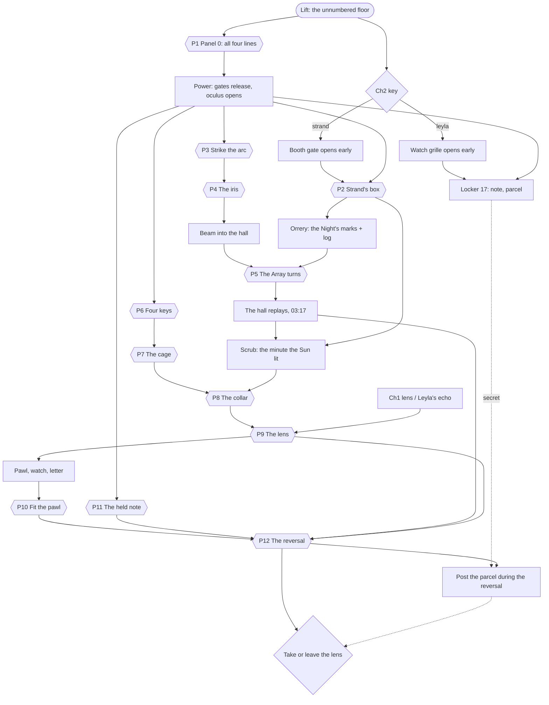

# Chapter 4 — The Experiment (the Array Hall, the unnumbered floor)

**Status:** design and logic (`game/src/rooms/array_hall/array_hall_logic.gd`, `ArrayHallLogic`). No scene or models yet: they come from the model and scene agents using this page and `docs/models/ch4.md` (to be written from the models section below).
**Target:** 40–55 minutes for a first-time player. 12 linked puzzles, four optional echoes, one secret, a finale choice and three endings that depend on Chapters 1–3.
**Design rules:** the same as Chapters 1–3 (`docs/PUZZLE_DESIGN.md`):
- every answer comes from in-world evidence;
- every solution is language-neutral;
- items are never lost and every mechanism is reversible;
- there are parallel branches;
- every goal has a three-level hint ladder;
- every code-like answer varies per game (`docs/VARIANTS.md`).

**New in this chapter:** the room *is* the machine. The Lumen Array fills the hall; you stand on a bridge above it and turn forty-metre rings, you watch the Night of Silence replay as kept light, and in the end you wind the Institute's clock backwards from 03:17, one minute at a time, undoing what Strand did at each minute. The Room's nested boxes return at two scales: Strand's small gear box in his booth, and the Reliquary around the Core, four layers deep, at the centre of the Array.

## Story
The freight lift's lowest button has no number. It opens onto the Array Hall, the great round hall under the Resonance Gallery's glass floor: four steel rings on rails, each carrying a mirror tower, around a brass-and-glass housing with the Core inside it, the great crystal. Forty-one slow lights circle inside the Core. If you trusted Leyla, a forty-second light turns toward you as you enter.

On the Night of Silence (14 November 1979), in the three minutes before 03:17, Strand lit the Sun (the hall's arc lamp), had the rings set so the Sun's light folded into the Core, turned the Core to the Choir's note, and at 03:17 pulled the master lever. The flash kept everyone in the beam, Strand among them. Every clock stopped.

The Array can **replay** a kept moment as ghostly light when the Sun's beam is folded into the Core. The chronometer on the bridge scrubs the replay through the minutes of the Night, but like any clock it only runs forward. In his box Strand left the log of the Night; in the Reliquary, under the Core, he left the **reverse pawl** he made for the chronometer and never dared to fit, and a letter: *"Let them go. Leave me the light."*

Leyla came here in 1998. She locked nothing and hid nothing this time: she left her note in her old locker and went into the light after them, carrying (if you left it for her in Laboratory 7) the crystal lens. In the true ending, you learn who posted the parcel that started the game, and when.

### Text beats (canonical EN; RU/UZ in `tools/localization/strings_ch4.py`)
| Key | Text |
|---|---|
| Intro (Strand's key) | The freight lift sinks past Level −2. On the tag of Strand's key, a second line you never noticed: “— and below the Choir, the Hall.” |
| Intro (Leyla's key) | The freight lift sinks past Level −2. On the tag of Leyla's key, a second line you never noticed: “— and below the Nursery, the Hall. Finish it.” |
| Intro 2 | The Array Hall. Every clock in the Institute stopped here, at 03:17. |
| Strand's plate on Panel 0 | (pictogram only: four filled discs over the four line lamps) |
| Leyla's chalk on Panel 0 | L.R. 1998 — this time, all four. |
| Strand's log (in his box) | Tonight: the Sun, the rings and the Choir's note, each in its minute, and my hand on the lever at 03:17. I have sealed the Core and set its collar to the minute the Sun is lit. If anyone must open it again, let it be someone who watched. |
| Strand's last letter (heart drawer) | Leyla — I made the pawl that lets the clock run back. I never dared to fit it. If you are reading this, you dared more than I did. Let them go. Leave me the light. — E.S. |
| Pocket watch (engraved) | E.S. — light remembers |
| Leyla's note, 1998 (locker 17) | If the post still runs when time runs back, send it to the laboratory. You know which one. — L.R., 1998 |
| Parcel label (secret) | Laboratory 7. |
| Finale prompt | The forty-one are gone into the morning. The crystal lens is still warm in the cradle. |
| Epilogue, Dawn | Forty-one lights rise through the oculus into the morning. A forty-second stays, by its own choice; it turns toward you once, then looks up. |
| Epilogue, Keeper (trusted Strand) | Forty lights rise through the oculus. One settles back into the Core and hums a single held note, softly: Strand, keeping the light he could not let go. A forty-second stays beside it and turns toward you. |
| Epilogue, true | Forty-one lights rise through the oculus. The forty-second rises last. It pauses at the rim and looks at you the way it did in Laboratory 7. |
| Epilogue, parcel | Far above, a brass canister drops into the dead station of Laboratory 7. Brown paper, string, a 1979 postmark. It will wait for you. |
| Epilogue, end | Every clock in the building reads 03:13, and ticks. The Institute is no longer forgotten. |

## Signature mechanics (new in Chapter 4)
| # | Mechanic | Builds on | In this chapter |
|---|---|---|---|
| M13 | **The Array as a mechanism** | Ch1 gear box | Four concentric rings on rails, each with a mirror tower. Four handwheels on the bridge rail: wheel *i* turns ring *i* **and its inner neighbour** one mark of eight; the innermost turns alone. Strand's rule from Chapter 1 ("turn one wheel and its neighbour follows"), forty metres wide. You see the whole hall move |
| M14 | **Replay and scrub** | Ch1 projector, Ch3 witness ports | With the Sun's beam folded into the Core, the hall fills with the kept Night: 41 figures of light frozen at 03:17. The chronometer's wheel scrubs them through 03:10–03:17, forward only. The strip chart under the wheel draws the Night's pen marks at the same minutes |
| M15 | **The Reliquary** | The Room's nested boxes | Around the Core: a brass cage with four gates (keys on the four towers), a glass tower with a collar lock (the minute the Sun was lit), the cradle with a lens socket, and under it the heart drawer that opens for the Institute's mark projected by the lens |
| M16 | **The Sun** | Ch1 radio tuning | A carbon arc the size of a car. Feed the rods until they touch (the needle slams to the stop), then back them off until the needle sits in the green: the arc strikes and steadies. Too far and it snaps out. In front of it a two-metre iris of six overlapping leaves, lifted in the order they lie |
| M17 | **Beat tuning** | Ch3 melody, Ch2 receiver | The keeper knob plays a note against the Core's own. Far off, the two notes beat fast; closer, slower; matched, steady. The oscillograph draws the beat envelope so the ear is never the only cue |
| M18 | **Time reversal** | Ch1 drawer 03:17, Ch3 startup order | With the pawl fitted, the chronometer winds back. At each minute you must undo what Strand did at that minute, in reverse order, before the wheel will move. Rush it and the Array snaps back to 03:17: every lever slams down, the rings grind back, the Sun relights |
| M19 | **Posting into the past** (secret) | Ch2 pneumatic post | While time runs back, the Institute's post runs too. The right address sends Leyla's parcel to Laboratory 7, 14 November 1979 |

## Consequences of earlier chapters
| Earlier result (`profile.choices`) | Effect in Chapter 4 |
|---|---|
| `ch2_key = strand_key` | The intro reads Strand's tag. **Strand's key opens the booth gate before power**, so his box and log are the first thing you can reach |
| `ch2_key = leyla_key` or **no earlier save** | The intro reads Leyla's tag. **Leyla's key opens the watch-room grille before power**, so her locker (her 1998 note, and the parcel if the secret is live) is the first thing you can reach. After Panel 0 both gates release for everyone |
| `ch1_lens = take_lens` | You carry the **crystal lens** with the Institute's mark recorded in Chapter 1. You seat it in the cradle yourself. Kept echoes are visible while you hold the lens |
| `ch1_lens = leave_lens` or no save | When the glass tower opens, **Leyla's echo steps out of the Core, seats the lens you left for her, and fades**. The lens is then yours to take or leave |
| `ch3_trust = strand` | The Core hums a single held note; Strand's echo stands at the master desk when the hall first replays. **Ending: the Keeper** — forty rise, Strand stays by his own wish |
| `ch3_trust = leyla` or no save | The Core's note is falling; the forty-second light turns toward you when you first look at the Core. **Ending: Dawn** — all forty-one rise |
| `ch3_true_ending = true` (Leyla asked for a place at the 42nd socket) | **The secret is live:** Leyla's parcel waits in locker 17. Posted to Laboratory 7 while time runs back, it gives the **true ending**: the forty-second light rises too, and the parcel's 1979 postmark is explained |
| `ch1_shards = 5`, `ch2_echoes = 3`, `ch3_echoes = 4` and all four Chapter 4 echoes | Epilogue line "Every shard found, every echo released" and the achievement |

Fair default: a player who starts Chapter 4 with no earlier save gets Leyla's key, the leave path and the Dawn ending — a complete chapter with every puzzle, only the secret and the Keeper ending are tied to earlier choices, as the 42nd socket was in Chapter 3.

## Space (the Array Hall; Godot metres, Y up, north = −Z)
One round hall, radius 14 m under a 12 m vault with an oculus (the shaft up to the Gallery's glass floor). One scene in zones along the two axes; zones out of view are culled as in Chapter 3.

| Zone | Extent | Contents |
|---|---|---|
| **Lift landing** | south alcove, cage at (0, 0, 15.5) | The lift's lowest stop. Leyla's chalk sign (crescent and three dots) and "1998" by the arch. Stairs up to the bridge |
| **Operator's bridge** | x ∈ [−4, 4], z ∈ [12, 15], deck at y = 2.0 | The **master desk**: the chronometer (time wheel 03:10–03:17, strip-chart drum), the **master lever** (down since 1979), the **keeper knob** (0–12) with its oscillograph. On the north rail the **four handwheels** I–IV (outer → inner). The catwalk gate at the centre of the rail |
| **Panel 0** | under the bridge, south wall (0, 0, 13.8) | The hall's distribution panel: 5 switches I–V, 4 line lamps LOCK · LIGHT · ARRAY · VENT, engraved traces, the main lever, Strand's plate (four filled discs), Leyla's chalk |
| **The Array floor** | centre, r ≤ 11.5 | Rings I–IV at radii 10.5, 8.5, 6.5, 4.5 on rails; each carries one **mirror tower** (1.6 m, a numeral plate and a key bracket at its base). Eight radial **floor marks** 1–8 (1 = south, under the catwalk; clockwise seen from the bridge: 3 = west toward the Sun, 5 = north, 7 = east) |
| **The catwalk** | z from 12 to 3, deck at y = 2.5 | Runs from the bridge to the island over the four rails. A **floor hatch** above each rail at mark 1 (z = 10.5, 8.5, 6.5, 4.5): a tower standing at mark 1 is reached through it |
| **The island / Reliquary** | r ≤ 3 | The **cage** (brass lattice, 3 m, four gates I–IV facing the catwalk and the three other quarters), the **glass tower** (Ø 2.2, 3.5 m, collar lock with four digit wheels on its south face), the **Core** (crystal 1.2 m, 41 circling lights), the **cradle** with the lens socket (south, chest height), the **heart drawer** under it (brass, a frosted face with the Institute's mark) |
| **The Sun apse** | west, lamp at (−13, 1.2, 0) | The **Sun**: a brass arc-lamp sphere Ø 2.4 m on a pedestal, the **iris** (Ø 2 m, six leaves) in front of it, the **control pedestal** (feed wheel, ammeter with a green band, the Sun lever) |
| **Strand's booth** | north, glass booth at (0, 2.0, −13), stair gate at (0, 0, −11.5) | His desk with the stopped wall clock (03:17), his coat, **Strand's gear box** (walnut, four knobs; inside: the **orrery**, a brass model of the Array, and his log) |
| **The watch room** | east, (13, 0, 0), grille at (11.5, 0, 0) | The **roll board** (41 brass tags on hooks, 41 small lamps), a row of **lockers** (17 is Leyla's), the **pneumatic post station** (destination dial with six pictograms, number wheel 1–9, canister, send lever) |
| **The oculus** | above the Core, Ø 3 m at y = 12 | The shaft to the Gallery. Its vent shutter opens when the VENT line goes live |

### Camera views (fixed targets for the scene agent; positions are proposals)
| View | Looks at | Notes |
|---|---|---|
| `lift` (R, intro) | the arch and the dark hall beyond | the Core's glow is the only light |
| `bridge` (R) | the whole hall from the desk | the money shot: rings, towers, the Core, the oculus |
| `desk` | chronometer, master lever, keeper knob | the time wheel and the strip chart are readable |
| `chronometer` | the wheel and the chart drum | close-up for scrubbing |
| `handwheels` | the four wheels and, beyond the rail, the rings | the rings' motion must be visible from here |
| `panel0` | the panel | traces readable |
| `catwalk` (R) | along the catwalk to the island | hatches visible |
| `hatch_1`..`hatch_4` | down through a hatch at a tower's base | the key bracket |
| `island` (R) | the cage and the tower | the 42nd light turns here (trust Leyla) |
| `gate_1`..`gate_4` | one gate's lock face | |
| `collar` | the four digit wheels | |
| `core` | the Core, cradle and heart drawer | Leyla's echo seats the lens here (leave path) |
| `apse` (R) | the Sun and the iris from the floor | |
| `sun_pedestal` | feed wheel, ammeter, lever | the needle and the green band |
| `iris` | the six leaves | overlaps clearly readable |
| `booth` (R) | Strand's desk | |
| `gear_box` | the box, then the open box with the orrery | the orrery's four rings and their marks |
| `watch` (R) | the roll board and lockers | |
| `locker_17` | the open locker | |
| `post_station` | the dial, the number wheel, the canister | |

## Acts & puzzles
Order within an act is fixed by evidence, not by locks, and the acts overlap: after Panel 0 the booth, the Sun apse, the rings and the watch room are all open at once.

### Act I — Lines and light (bridge, Panel 0, booth, Sun apse)
| # | Puzzle | Type | Evidence | Solution | Reward |
|---|---|---|---|---|---|
| P1 | **Panel 0 — all four lines** | Logic (Chapter 1's Panel 7, inverted) | Strand's plate: four filled discs over the four lamps. The engraved traces show which lamps each switch feeds. Leyla's chalk: "this time, all four" | Switch set whose traces light LOCK, LIGHT, ARRAY and VENT at once (canonical: I and II; IV and V also works), then the main lever | **Power.** Work lamps wake ring by ring; the oculus shutter opens; the booth gate, the watch grille, the catwalk gate and the apse release; the desk hums |
| P2 | **Strand's box** | Mechanical (Ch1 gear box, four gears) | The box has four knobs and four gears with pointers; a brass plate under the lid repeats his line from Chapter 1 as a pictogram: a wheel with an arrow to its neighbour. Knob *i* turns gear *i* and gear *i*+1 one step of six; the fourth turns alone | All pointers to the mark. Canonical start 4-1-3-5 → press 2, 3, 0, 1 (work from the first knob to the last) | The lid opens: **the orrery** (a brass Array whose four towers stand at the Night's marks) and **Strand's log** |
| P3 | **Strike the arc** | Tactile, feedback (M16) | The pedestal: a feed wheel (gap 0–9), an ammeter with a **green band**, the Sun lever. The plate: rods touching, then an arrow back to the green | Lever ON. Feed the rods to 0 (the needle slams to the stop: shorted). Back off until the needle sits in the green (canonical gap 4). Gap 8–9 snaps the arc out; the lever OFF kills it | The Sun burns behind the closed iris; light leaks between the leaves |
| P4 | **The iris** | Observation, order (M16) | Six brass leaves overlap. A leaf under another cannot lift; the one on top can. Lifted leaves latch up | Lift from the top of the stack down (canonical 3, 6, 1, 5, 2, 4) | The iris opens: the beam shoots across the hall toward ring I |

### Act II — The Array (bridge handwheels, catwalk, island)
| # | Puzzle | Type | Evidence | Solution | Reward |
|---|---|---|---|---|---|
| P5 | **The Array turns** | Coupled mechanism, light routing (M13) | The orrery shows each tower at a mark (canonical I 3, II 6, III 8, IV 5). The floor marks 1–8 and the towers' numeral plates. Wheel *i* turns ring *i* and ring *i*+1; the beam visibly reaches tower *k* only when rings I..*k* stand right | Work from the outer ring in: set I with wheel I, then II with wheel II (which also drags III), then III, then IV | **The hall replays:** the beam folds into the Core and forty-one figures of light appear across the floor, frozen at 03:17. The chronometer's wheel unlocks. (Trust Strand: his echo stands at the desk) |
| P6 | **Four keys** | Exploration with the wheels | Each tower carries a brass key in a bracket at its base. The catwalk has a hatch over each rail at mark 1 | Bring each tower to mark 1 (wheel *i*, remembering it drags ring *i*+1) and take the key through the hatch. The beam breaks and the figures fade while a ring is out of line: they return when it is re-aligned | Keys I–IV |
| P7 | **The cage** | Keys | Four gates, each with a numeral | Each key in its own gate (a key stays in its gate) | The cage opens: the glass tower |
| P8 | **The collar — the sealed minute** | Code from the replay (M14) | Strand's log: "I have sealed the Core and set its collar to the minute the Sun is lit." Scrub the chronometer: at one minute the ghost Sun flares and the figures turn to it; the strip chart's first pen mark stands at the same minute | Collar 0-3-1-*m* (canonical 0-3-1-4) | The tower's panels sink: the Core bare, the cradle, the heart drawer. (Trust Leyla: the forty-second light turns to you.) Leave path: Leyla's echo seats the lens |

### Act III — The heart (island, bridge)
| # | Puzzle | Type | Evidence | Solution | Reward |
|---|---|---|---|---|---|
| P9 | **The lens** | Light memory (M1) | The cradle has a socket the size of the crystal lens. The heart drawer's face is frosted glass with the Institute's mark | Seat the lens (take path; on the leave path Leyla's echo does it). The Core's light passes through the lens and the recorded mark falls on the drawer's face: it opens | **The heart drawer:** Strand's pocket watch, his last letter, the **reverse pawl** |
| P10 | **The pawl** | Mechanism | The chronometer's open back shows an escapement with an empty pawl seat. The letter names the part | Fit the pawl | The chronometer can run back |
| P11 | **The held note** | Beat tuning (M17) | The Core hums. The keeper knob (0 off, 1–12) plays a note against it; the oscillograph shows the beat: fast far away, slower nearer, flat when matched | Turn until the beat stops (canonical 7) | Full resonance: the Core's lights brighten and hold |

### Act IV — The Night, backwards (bridge; one trip each to the floor and the apse)
| # | Puzzle | Type | Evidence | Solution | Reward |
|---|---|---|---|---|---|
| P12 | **The reversal** | Time reversal (M18) | The replay and the strip chart show what happened at which minute: the Sun lit, the rings set, the keeper turned (three minutes in some order), and at 03:17 the master lever. Strand's letter: "let the clock run back" | With the Sun steady, the rings aligned, the lens seated, the keeper on and the wheel at 03:17: **lift the master lever**. Then wind back one minute at a time. At each minute undo that minute's action **before** winding on: keeper to 0 at its minute, the rings **home** (all at mark 1) at theirs, the Sun lever OFF at its. Anything out of order, or winding past an undone minute, snaps the Array back to 03:17 (the levers slam down, the rings grind back, the Sun relights): nothing is lost, start again from the lever | **The Night undone:** at the minute before the Sun was lit the hall is dark and forty-one lights rise through the oculus |
| — | **Finale: the lens** | Narrative choice | The lens is warm in the cradle | *Take the lens* (the Core goes dark) / *Leave it* (the Core keeps replaying ordinary days) | `choices.ch4_lens` |
| ★ | **Kept echoes 0/4** | Optional | A technician at Panel 0, two at the handwheels, a clerk at the post station, Leyla at the lift (1998). Visible while holding the lens (take path) or while the hall replays (both paths) | Tap to release | Epilogue line, achievement |
| ★ | **The parcel** | Secret (M19), needs `ch3_true_ending` | Locker 17: Leyla's note and the parcel addressed to Laboratory 7. The post dial's pictograms (the Chapter 2 set) and the number wheel | Parcel in the canister, dial on the laboratory flask, number 7, **send while time runs back** (any minute of the reversal). Sent at any other time, the canister knocks back: no receiver | The true ending |

### Data tables
- **P1 Panel 0** (✓ = the switch toggles that lamp; canonical):

| Switch | LOCK | LIGHT | ARRAY | VENT |
|---|:-:|:-:|:-:|:-:|
| I | ✓ | | ✓ | |
| II | | ✓ | | ✓ |
| III | ✓ | ✓ | | ✓ |
| IV | | | ✓ | ✓ |
| V | ✓ | ✓ | | |

  Target: all four live. The matrix has rank 4, so there are exactly two switch sets: {I, II} and {IV, V}. Every variant matrix keeps rank 4 (always exactly two solutions), every switch feeds something, every line is fed by at least two switches, and no single switch feeds all four.
- **P2 box:** gears 0–5, target all 0. Canonical start [4, 1, 3, 5], presses [2, 3, 0, 1]. The solution is unique because the coupling is triangular (knob 4 turns only gear 4).
- **P3 arc:** gap 0–9 starts at 9. Needle: 0 cold, 10 shorted, 10 − gap lit. Green band at 10 − *g*, *g* ∈ 2..6 (canonical 4). Lit only for gaps 1–7; 8–9 snaps the arc out (back to cold). Lever OFF → cold.
- **P4 iris:** six leaves, a stack order (top → bottom); canonical [3, 6, 1, 5, 2, 4]. A leaf lifts only when every leaf above it is up.
- **P5 rings:** positions 0–7 (mark = position + 1). Canonical start [4, 2, 6, 1] (marks 5 3 7 2), target [2, 5, 7, 4] (marks 3 6 8 5). Wheel *i* adds ±1 to ring *i* and ring *i*+1 (wheel 4 only ring 4). The beam reaches tower *k* when rings 1..*k* equal the target. All rings at mark 1 with the Sun on gives a **weak** replay (figures flicker): the straight path through the gaps.
- **P8 collar:** four wheels 0–9, start 0-0-0-0, target 0-3-1-*m*_sun.
- **P11 note:** knob 0–12 with end stops, start 0, target *k* ∈ 1..12 (canonical 7). Beat = |pos − *k*|.
- **P12 Night:** wheel positions 0–7 = 03:10–03:17. Three distinct minutes in 03:11–03:16 for the Sun, the rings and the keeper (canonical Sun 03:14, rings 03:15, keeper 03:16); the master lever is always 03:17. The release happens when the wheel reaches the minute before the earliest action.
- **Secret:** post dial 0 ✦ director, 1 book, 2 flask (laboratories), 3 film, 4 letter, 5 lock; number wheel 1–9. Laboratory 7 = dial 2, number 7.

## Dependency graph

Parallel branches:
- After P1: the booth (P2), the Sun apse (P3–P4), the keys (P6) and the watch room are all open; P11 can be done any time after P1.
- The take path skips Leyla's echo at P9; the leave path waits for it.
- Echoes can be released at any time while visible; the parcel at any minute of the reversal.

## Hint ladder
Each row shows level 1 (nudge), level 2 (where to look) and level 3 (answer). Level 3 names this game's own answer.

| Goal | Condition | 1 | 2 | 3 |
|---|---|---|---|---|
| power | no power | The hall is dead. | The panel under the bridge: Strand's plate wants every lamp lit. Follow the traces. | Switches %s up, then the main lever. |
| box | booth open, box shut | Strand's box waits on his desk. | Each knob drags the next gear along; the last turns alone. Start with the first. | Press the knobs: ×%d, ×%d, ×%d, ×%d. |
| sun | arc not steady | The Sun is cold. | Lever on. Feed the rods together until the needle slams over, then back them off into the green. | Rods to 0, then back to %d. |
| iris | iris shut | The Sun burns behind its iris. | A leaf under another will not lift. Start from the top of the stack. | Leaves %s. |
| align | replay never seen | The beam stops at the rings. | The orrery in Strand's box shows where each tower stood. Each wheel drags the next ring: work from the outer ring in. | Towers I–IV at marks %s. |
| keys | a tower key missing | The cage has four locks. | Each tower carries its gate's key. Bring a tower to mark 1 and reach it through the hatch. | Turn each ring to mark 1 in turn, outer first, and take the key below. |
| cage | keys, cage shut | Four keys, four gates. | The numerals match. | Each key in the gate with its numeral. |
| collar | cage open, tower shut | Strand sealed the Core. | "…its collar to the minute the Sun is lit." Scrub the chronometer and watch the Sun. | 0-3-1-%d. |
| lens | tower open, no lens seated | The cradle has an empty socket. | The crystal lens fits it. The drawer below opens for the Institute's mark. | Seat the crystal lens in the cradle. |
| pawl | drawer open, pawl not fitted | Strand made a part he never fitted. | Take the pawl from the drawer. The chronometer's back is open. | Use the reverse pawl on the chronometer. |
| note | keeper off | The Core hums a note of its own. | Turn the keeper knob and watch the beat on the oscillograph: slower is closer. | Keeper at %d. |
| reversal | everything set, Night not undone | Run the Night backwards. | Lift the lever at 03:17. Then wind back a minute at a time, undoing each minute's step before you wind: keeper off, rings home, Sun off. | Lever at 03:17. Then at 03:1%d %s, at 03:1%d %s, at 03:1%d %s. |
| finale | Night undone | The lens is still in the cradle. | Take it, or leave it. | Choose. |

## Ending matrix
| Ending | `ch4_ending` | Condition | What the player sees |
|---|---|---|---|
| **Dawn** | `dawn` | default (trusted Leyla, or no Chapter 3 save) | Forty-one lights rise. The forty-second stays and turns to you |
| **The Keeper** | `keeper` | `ch3_trust = strand` | Forty lights rise. Strand's light stays in the Core and hums one held note. The forty-second stays beside it |
| **The Forty-second** (true) | `true` | `ch3_true_ending` and the parcel posted during the reversal | Forty-one rise, the forty-second last; the parcel's postmark is explained. With `ch3_trust = strand` Strand still stays (an extra line) |

Every ending adds the lens line (taken: the Core goes dark; left: it replays ordinary days), the echo line if all four Chapter 4 echoes are free, and "Every shard found, every echo released" if shards 5, Ch2 echoes 3, Ch3 echoes 4 and Ch4 echoes 4. Profile output: `ch4_ending`, `ch4_lens`, `ch4_echoes`, `ch4_parcel`.

## Echoes and the secret
- **Kept echoes (0/4):** `tech_panel` (Panel 0), `tech_wheels` (two technicians at the handwheels), `clerk_post` (the watch room station), `leyla_lift` (Leyla at the lift, 1998). Visible in their zone while a crystal is held (take path) or while the hall replays (both paths). Releasing is optional; achievement "Echoes of the Hall".
- **The secret:** with `ch3_true_ending`, locker 17 holds Leyla's parcel. The post station accepts it; sent with the dial on the flask and the number on 7 **while the Array runs back**, it leaves and does not return (`parcel_sent`, the true ending). Sent at any other time or to any other address, the canister knocks back with the parcel inside. Nothing is lost.

## Softlock analysis
- **Panel 0:** switches toggle freely until the lever locks them live. No breaker trip in this chapter: a wrong set simply leaves lamps dark.
- **The box, the collar, the iris, the keeper:** reversible or monotonic (lifted leaves latch; the collar and the box lock only when solved).
- **The arc:** every state is reachable from every other with the lever and the feed wheel.
- **The rings:** every position is reachable (each wheel runs both ways). The keys are taken once and used once; a key fits only its own gate and stays there.
- **The lens:** it can be taken out of the cradle and seated again, except while time runs back (it is "held fast" and freed when the Night is undone or the Array snaps back).
- **The reversal:** a snap-back restores the 03:17 configuration (Sun steady, rings aligned, keeper on, lever down) and nothing else. The player loses no item and at most a minute of work.
- **The parcel:** it comes back from every wrong send and from the canister.
- **Fuzz:** random play over many seeds on both keys, both lens paths and both trust values must always leave the solver able to finish and to reach the ending the profile allows.

## WOW moments (≈ every 3–5 min)
| Min | Moment |
|---|---|
| 0 | The lift passes Level −2 and keeps sinking. The doors open on a black hall; far off, forty-one slow lights circle inside a crystal |
| 3–5 | **Power:** relays clack under the bridge and work lamps wake ring by ring, each ring a hundred metres of rail; high above, the oculus shutter grinds open and a disc of light appears |
| 6–8 | Strand's box: the gears mesh, the lid rises, and inside sits a tiny brass Array with its towers set |
| 9–12 | **The Sun:** the rods touch, the needle slams, the arc strikes with a crack and the apse turns white. Six brass leaves lift one after another and a beam the width of a door shoots across the hall |
| 13–18 | **The Array turns:** rings grind on their rails, towers slide past, the beam folds tower to tower and enters the Core. **Forty-one figures of light stand across the floor, frozen at 03:17** |
| 19–24 | The chronometer scrubs: the figures move, the ghost Sun flares, Strand's ghost reaches for the lever. You break the beam to fetch a key and they fade like breath |
| 25–30 | The cage opens; the glass tower sinks; the Core bare, lights circling an arm's length away. Leave path: Leyla steps out of the light and seats the lens |
| 31–36 | The heart drawer opens for the mark; the pawl clicks into the clock; the keeper's beat slows and stops |
| 37–48 | **The reversal:** the lever lifts and the frozen hall unfreezes backwards; at each minute something undoes itself; the rings grind home; the Sun goes out; in the dark, **forty-one lights rise through the oculus** |

## Why this is the most interesting chapter
| | Chapter 1 | Chapter 2 | Chapter 3 | Chapter 4 |
|---|---|---|---|---|
| Scale of the mechanism | a desk, a projector, two mirrors | a room with tubes in the ceiling | three halls and a shaft | **the whole hall moves**: four forty-metre rings you turn from a bridge, a two-metre iris, a car-sized arc lamp |
| The signature "one more layer" | the bookcase, the safe | the booth, the vault | the office, the camp | **the Reliquary**: cage → tower → cradle → heart drawer, each layer opened by something learnt elsewhere in the hall, plus Strand's small box whose rule is the Array's own |
| Light | one beam, two mirrors | two beams overlaid | fans and a figure | **a beam folded through four towers you see move**, and the hall itself replaying as light |
| Time | a stopped clock | a film | witness ports | **you hold time in your hand**: scrub the Night forward, then wind it back minute by minute while the hall undoes itself |
| Mechanics reused in new ways | — | Ch1 recording, overlaid | Ch1 beam → fans; Ch2 receiver → meter | Ch1 gear box at hall scale; Ch1 Panel 7 inverted; Ch1 03:17 as a *found* minute; Ch3 witness replay under your control; Ch2 post into the past |
| Agency in the story | take or leave the lens | which key | whom to trust | **you perform the undoing yourself**, and the endings pay off every earlier choice |
| Fairness | evidence in the room | evidence in the room | evidence in the room | the same, with **live feedback on every step** (beam reach, needle, beat, figures) so no step is a guess |

What a player of The Room should notice: every box opens into something bigger than itself, every mechanism is seen moving, and the final box is the hall.

## Models (to be specified in `docs/models/ch4.md` the way `ch3.md` does; groups for the Blender agents)
- **A — shell and circulation:** `shell_hall` (round hall r 14, vault, oculus and vent shutter, floor marks 1–8 as inlays), `shell_lift4` (lowest landing, arch, Leyla's chalk decal), `bridge` (deck, stairs, north rail with four handwheel mounts, catwalk gate), `catwalk` (deck, four floor hatches with lids), `shared_numerals` (I–V inlay outlines, reused by every group).
- **B — the bridge desk:** `master_desk` (chronometer face 03:10–03:17 with the time wheel, strip-chart drum with a pen that draws from state, back plate that opens with an empty pawl seat), `master_lever` (down/up), `keeper_knob` with `oscillograph` (0–12 collar), `handwheel` (×4 instances, 8 click stops), `panel0` (5 switches, 4 lamps, traces as 20 decal variants or toggled meshes, main lever, Strand's plate, chalk decal).
- **C — the Array:** `ring_rail` (×4 radii), `array_ring` (×4, geared rim, 8 index notches), `mirror_tower` (×4: 1.6 m post, 45° mirror, numeral plate, key bracket with the key mesh toggled), `beam_segments` (five emissive ribbons the code shows per fold), `floor_mark` (×8).
- **D — the Reliquary:** `cage` (lattice, four `IA_gate_n` with numeral lock faces), `glass_tower` (panels that sink, `collar` with four `IA_collar_digit_n`), `core_crystal` (emissive, 41 + 1 light sprites via MultiMesh), `cradle` (lens socket mount, projected-mark decal on the drawer face), `heart_drawer` (slides out; mounts for the watch, the letter, the pawl).
- **E — the Sun apse:** `sun_lamp` (sphere, rods, emissive arc), `sun_iris` (six `IA_leaf_n`, each with its stacking height), `sun_pedestal` (feed wheel, ammeter with a green band set from state, Sun lever).
- **F — Strand's booth:** `booth` (glass, stair gate, stopped clock), `booth_desk`, `strand_box4` (four `IA_knob_n`, four gears with pointers, lid), `orrery` (four tiny rings with towers placed from state).
- **G — the watch room:** `roll_board` (41 tags, 41 lamps that go out one by one in the finale), `lockers` (row, `IA_locker_17`), `post_station4` (destination dial with the Chapter 2 pictograms, number wheel 1–9, canister, send lever, tube into the ceiling).
- **H — items:** `tower_key` (×4 numerals), `strand_log`, `pocket_watch`, `strand_last_letter`, `reverse_pawl`, `leyla_note_1998`, `leyla_parcel`; existing: `crystal_lens`, `key_strand`, `key_leyla`.
- **I — echoes:** `echo_crowd` (33 simplified standing figures, one MultiMesh, three poses), `echo_named` (8 detailed figures for the foreground), `echo_strand_desk` (at the master lever, frozen reaching), `echo_leyla_1998_lift` and `echo_leyla_1998_lens` (walks from the Core to the cradle), `echo_tech_panel`, `echo_tech_wheels` (two), `echo_clerk_post`.

## Audio
- **Ambience:** the Core's hum (a held note on the Strand path; a slowly falling note on the Leyla path), ring rails at rest, air moving down the oculus once the vent opens.
- **Mechanisms:** relay clacks and lamp warm-ups (P1); gear clicks and the lid (P2); the needle slam, the arc's crack and hiss, the arc snapping out (P3); six leaf lifts in brass (P4); ring motors, the grind of steel on rails, the beam's chime at each fold (P5); hatch lids, key clinks, gate bolts (P6–P7); collar clicks and the sinking glass (P8); the drawer's slide (P9); the pawl's click (P10); the beat (two sines, the envelope audible) (P11); the chronometer's ratchet, the snap-back slam, the lights rising (P12); the canister's rush and the far-off knock (secret).
- **Story audio:** no voices; the replay is silent except a low wash that rises and falls with the scrub.
- **Music:** `music_array_hall` (arrival and exploration), `music_array_hall_replay` (from the first replay), `music_array_hall_reversal` (from the lifted lever to the release), `music_array_hall_end`.

## Implementation data (the logic contract)
As implemented in `game/src/rooms/array_hall/array_hall_logic.gd` (`ArrayHallLogic`). Indices are 0-based in code; the texts above use the player's 1-based numerals and marks.

### Profile and zones
- `setup_from_profile`: `entry = "strand"` for `ch2_key = strand_key`, else `"leyla"` (also with no save). `has_lens` from `ch1_lens = take_lens`. `trust_strand` from `ch3_trust = strand`. `secret` from `ch3_true_ending`. The start inventory holds the Chapter 2 key and, on the take path, `crystal_lens`.
- Zones: `bridge`, `panel`, `lift` (always); `booth` (power, or Strand's key in the booth gate); `watch` (power, or Leyla's key in the grille); `apse`, `floor` (the catwalk and island) need power; `tower` (inside the glass) needs `tower_open`. The wrong key in a gate gives `gate_wrong_key`.
- `power` is set by the main lever when all four lines are live and locks the switches.

### P1 Panel 0
- `v_panel`: 20 ints, switch-major (`v_panel[s * 4 + line]`); `switches` 5 bools; `lines()` = parity per line. `pull_main()`: all four live → `power_on`, `solved:power`; else `lines_dead`. Variant matrices: rank 4 over GF(2), every switch non-empty, every line in at least two switches, no switch feeds all four. There are always exactly two solutions; `panel_solution()` returns the one with the fewest switches (then lexicographic) for the hint.

### P2 Strand's box
- `box` 4 ints 0–5, `press_knob(i)` adds 1 to gear *i* and *i*+1 (i < 3). Opens by itself when all are 0 (`box_open`, `solved:box`); knobs refuse afterwards (`box_is_open`). Pick-up `box_log` → `strand_log`. The orrery's marks are `v_align` (as marks = value + 1).

### P3 / P4 the Sun
- `sun_lever`, `gap` (0–9, start 9), `arc` (0 cold, 1 shorted, 2 lit), `v_gap` *g*. `toggle_sun_lever()`, `turn_feed(delta)`. `needle()` as in the data table; `sun_steady()` = lit and gap == *g*; the first steady gives `solved:sun`. Events: `needle:n`, `arc_shorted`, `arc_struck`, `arc_out`, `sun_steady`, `sun_flicker`, `sun_off`.
- `v_iris`: stack order top → bottom (leaf ids 0–5); `iris_up` 6 bools. `lift_leaf(i)`: a leaf with any leaf above it still down gives `leaf_pinned:i:j`; the last leaf gives `iris_open`, `solved:iris`.
- `beam_out()` = power and sun_steady() and iris_open.

### P5 / P6 / P7 the Array
- `rings` 4 ints 0–7, `turn_ring_wheel(i, delta)` adds to ring *i* and ring *i*+1 (i < 3), needs power (`wheels_dead`). `folded()` = leading rings equal to `v_align`; `aligned()`, `home()` (all 0).
- `replay_live()` = beam_out() and aligned(). Every action that can change it emits `replay_on` / `replay_off` on the transition and `beam:k` while the beam is out; the first `replay_on` gives `solved:align`, `hall_replays` and `guide_echo:strand` on the Strand path. `replay_weak` when the beam is out and the rings are home but not aligned.
- `tower_keys` 4 bools (key still on the tower). `take("tower_n")` needs power, ring *n* at 0 and the key present; otherwise `tower_out_of_reach`. All four taken → `solved:keys`.
- `use_item_on("tower_key_n", "gate_m")`: n == m → `gate_open:n` (the key stays in the gate); else `key_wrong_gate`. Four gates → `cage_open`, `solved:cage`.

### Chronometer
- `wheel` 0–7 (03:10–03:17), start 7. `scrub()` needs replay_live() and no reversal (`chrono_locked`): wheel = (wheel + 1) mod 8, `replay:m`, plus `replay_sun_lit`, `replay_rings_set`, `replay_keeper_on` or `replay_flash` at the Night's minutes. `v_night` = [m_sun, m_rings, m_keeper], distinct, 1–6.

### P8 the collar
- `collar` 4 ints 0–9, `turn_collar(i, delta)` (cage open, tower shut). Target `[0, 3, 1, m_sun]`. Opens by itself: `tower_open`, `solved:collar`, `forty_second_turns` (Leyla path); on the leave path also `leyla_echo_lens` and the lens is seated (`lens_seated`, `lens_by_leyla`). `try_collar()` gives `collar_shut`.

### P9 / P10 the heart
- `use_item_on("crystal_lens", "cradle")` with the tower open: `lens_seated`, `mark_projected`, `heart_open`, `solved:lens`. Other items → `cradle_refused`. `take_lens()` returns it to the inventory except while reversing (`held_fast`). The drawer stays open once opened.
- Drawer pick-ups: `heart_watch` → `pocket_watch`, `heart_letter` → `strand_last_letter`, `heart_pawl` → `reverse_pawl`.
- `use_item_on("reverse_pawl", "chronometer")` → `pawl_fitted`, `solved:pawl`.

### P11 the held note
- `keeper` 0–12 with end stops, `v_note` *k*. `turn_keeper(delta)` needs power; emits `keeper:p` and `beat:d` (d = |p − k|), `keeper_on` when p == k (first time `solved:note`), `keeper_off` at 0. `keeper_on()` = keeper == *k*.

### P12 the reversal
- `lift_master()` needs `pawl_fitted`, `lens_seated`, `keeper_on()`, `replay_live()`, wheel == 7, not yet up; otherwise `master_held`. Success: `master_up`, `reversing`, `reversal_begins`.
- While reversing: `turn_keeper` only at m_keeper, `turn_ring_wheel` only at m_rings, the Sun lever and feed only at m_sun, `scrub` never, `take_lens` never (`held_fast`).
- `wind_back()` (reversing, not undone): the current minute's undo must be done — 7: master up; m_keeper: keeper == 0; m_rings: home(); m_sun: lever off. Done → wheel − 1, `wound:m`; when wheel < min(v_night) → `night_undone`, `lights_rise`, `solved:reversal`, plus `strand_stays` (Strand path) and `forty_second_rises` (parcel sent). Not done → `snap_back`: wheel 7, lever down, reversing off, keeper = *k*, rings = `v_align`, Sun lever on with gap *g* and the arc lit.
- After the Night is undone nothing in the hall moves except the lens and the finale.

### Secret and echoes
- Locker 17 (`watch` open): `locker_note` → `leyla_note_1998`; `locker_parcel` → `leyla_parcel` only with `secret` (else `locker_bare`).
- Post station: `post_dial` 0–5 (`turn_post_dial`), `post_number` 1–9 (`turn_post_number`), `canister` holds `leyla_parcel` (`use_item_on("leyla_parcel", "post_canister")`, `take("post_canister")`). `send_post()` needs power and a loaded canister: reversing and dial 2 and number 7 → `parcel_sent`, `true_ending`; not reversing → `post_no_receiver`; wrong address → `post_returned`. The parcel stays in the canister when it returns.
- Echoes: `tech_panel` (panel), `tech_wheels` (bridge), `clerk_post` (watch), `leyla_lift` (lift). `echo_visible(id)` = zone open and (has_lens and a crystal selected, or replay_live()). `release_echo(id)`.

### Finale, profile, endings
- `choice_options()` = `take_lens` / `leave_lens` (`ui.lens4_take`, `ui.lens4_leave`, prompt `ui.choice_lens4_prompt`), allowed once `night_undone`. Taking puts `crystal_lens` in the inventory.
- `ending_id()`: `true` if `parcel_sent`; else `keeper` if `trust_strand`; else `dawn`.
- `profile_choices()`: `ch4_ending`, `ch4_lens`, `ch4_echoes` (0–4), `ch4_parcel`.
- `epilogue_keys()`: `epi4.<ending>`, `epi4.strand_stays` (true ending on the Strand path), `epi4.parcel` (true), `epi4.lens_taken` / `epi4.lens_left`, `epi4.echoes` (4/4), `epi4.all_light` (shards 5, echoes 3 + 4 + 4), `epi4.end`.

### Ids
- Items: `tower_key_1`..`tower_key_4`, `strand_log`, `pocket_watch`, `strand_last_letter`, `reverse_pawl`, `leyla_note_1998`, `leyla_parcel` (plus `strand_key`, `leyla_key`, `crystal_lens`).
- Puzzles (`solved:<id>`): power, box, sun, iris, align, keys, cage, collar, lens, pawl, note, reversal.
- Hint goals: `c4_power`, `c4_box`, `c4_sun`, `c4_iris`, `c4_align`, `c4_keys`, `c4_cage`, `c4_collar`, `c4_lens`, `c4_pawl`, `c4_note`, `c4_reversal`, `c4_finale`, in that order.
- Strings: `tools/localization/strings_ch4.py` (`msg.c4_*`, `cap4.*`, `obj4.*`, `doc4.*`, `echo4.*`, `intro4.*`, `epi4.*`, `ui.lens4_*`, `ui.choice_lens4_prompt`, `hint.c4_act.*`, `achv.collect_ch4`). Numerals I–V and digits are drawn as art; the texts write them as plain Roman numerals and digits, which the UI font has.

## Open points for the scene build
- **Scale on a phone:** the bridge view must show all four rings turning; the handwheel view needs the rings beyond the rail in frame so a player sees ring *i*+1 move with ring *i*.
- **Beam feedback:** draw the beam to tower *k* for `beam:k` and into the Core for the replay; the weak replay at home flickers at low alpha.
- **The replay crowd:** 41 figures is a MultiMesh of 33 plus 8 detailed; the scrub poses need only two or three keyframes per minute. Strand's ghost at the desk is the one figure that must read clearly at each minute (reaching for the Sun lever, the handwheels, the keeper knob, the master lever).
- **The strip chart** draws its pen marks from `v_night` so the minutes are readable without the replay (accessibility).
- **Snap-back** must be loud and quick: levers down, rings grinding back over ~2 s, the Sun relighting, then the figures freezing. Nothing else resets.
- **Leyla's echo (leave path)** walks from the Core to the cradle; the lens appears in the socket at the end of her walk. The take path shows the empty socket.
- **Variants** render from state: the panel traces (20 toggled trace meshes), the box start, the green band, the iris stacking heights, the orrery towers, the collar's answer is never shown (it comes from the replay), the keeper's answer is never shown (it comes from the beat), the strip chart marks.
