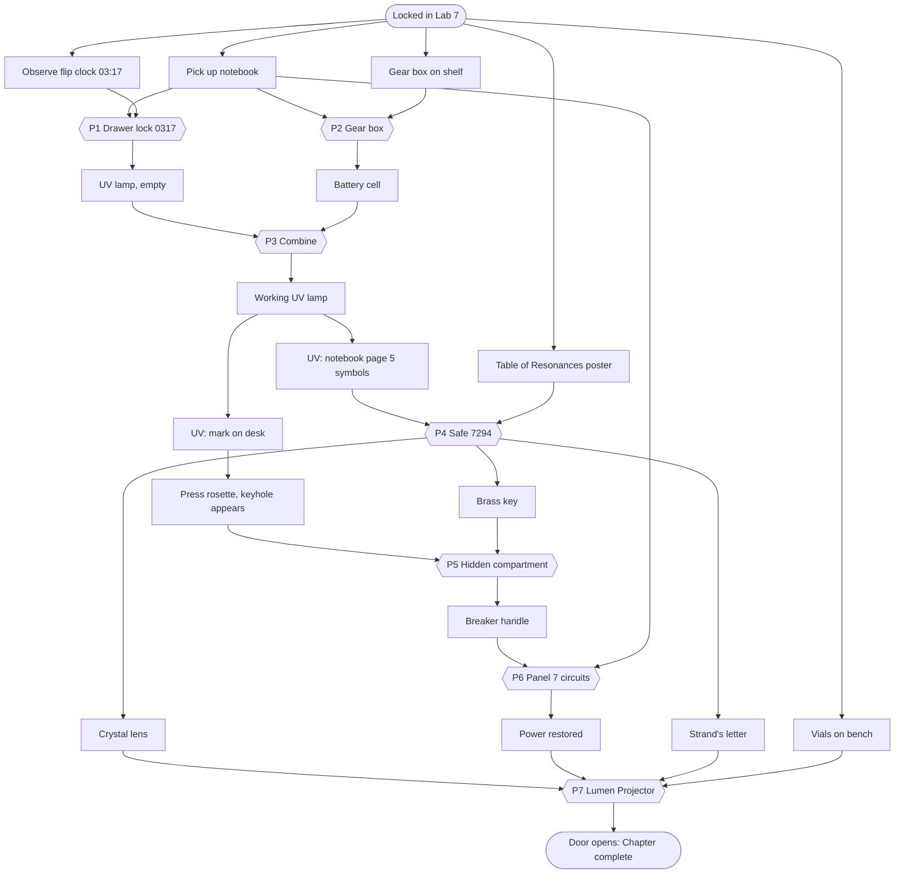

# Puzzle Design — Chapter 1: Laboratory 7

Design rules:
1. **Every solution is language-neutral.** It uses digits, symbols, colours, dot counts or density numbers only.
2. **No consumables can be lost.** An item is removed only when it is used correctly.
3. **Every mechanism is reversible.** The gear box, dials, switches and rings can always be turned back.
   No state can become unsolvable. Automated fuzz tests verify this (see `game/tests/test_no_softlock.gd`).
4. **At least two branches can be worked in parallel**, so a stuck player always has something else to do.
5. **Every step has a three-level hint ladder:** nudge, then where to look, then the explicit answer.

## Puzzle list

| ID | Puzzle | Type | Inputs | Solution | Reward |
|---|---|---|---|---|---|
| P1 | **Desk drawer lock** | Observation | Flip clock stopped at 03:17 + notebook page 2 ("the moment every clock stopped") | 4 brass wheels set to `0 3 1 7` | Leyla's UV lamp (no cell) |
| P2 | **Strand's gear box** | Mechanical | Notebook page 3 explains linking. Pressing knob *i* turns gear *i* and its neighbour *(i+1) mod 3* one step (6 positions). Start positions: A=1, B=3, C=2 | All three pointers up. Minimum 6 presses (A×2, B×1, C×3) | Battery cell |
| P3 | **Lamp assembly** | Combination | UV lamp + battery cell | Combine in the inventory | Working UV lamp |
| P4 | **Wall safe** | Hidden info + decoding | UV-ink page 5 in the notebook shows 4 symbols; the *Table of Resonances* poster gives each symbol a dot count | Keypad `7 2 9 4` | Brass key, crystal lens, Strand's letter |
| P5 | **Hidden compartment** | Hidden info + key | UV reveals a circle and an arrow on the desk's side, pointing at a carved rosette. Pressing the rosette slides out a panel with a keyhole | Use the brass key | Main-breaker handle |
| P6 | **Electrical panel (Panel 7)** | Logic | Breaker handle + notebook page 4 (LOCK, LIGHT, ARRAY on; VENT off). Five switches, each toggling engraved circuits | Main lever ON with lamps L=1, G=1, A=1, V=0 (e.g. switches 1+2+3, or 1+5). If VENT is live while the main lever is ON, the breaker trips safely back to OFF | Power restored; room lights come on; Array hums |
| P7 | **Lumen Projector** (final) | Deduction / meta | Crystal lens inserted + power + Strand's letter ("heaviest first") + vial densities (crimson 1.84, cobalt 1.26, green 0.79) | Rings set to crimson, cobalt, green, then pull the lever | The door opens; chapter complete |

### Switch matrix (P6)
| Switch | LOCK | LIGHT | ARRAY | VENT |
|---|:-:|:-:|:-:|:-:|
| S1 | ● | | | ● |
| S2 | | ● | | |
| S3 | | | ● | ● |
| S4 | ● | ● | | |
| S5 | | ● | ● | ● |

The solution space has kernel {S2, S3, S5}, so exactly two switch sets give the target: {S1, S2, S3} and {S1, S5}. Both count.

### Resonance symbols (P4)
Ten original glyphs. Each one appears on the poster with a dot count:

| Glyph id | Shape | Dots |
|---|---|---|
| `sun` | circle with a centre point | 7 |
| `crescent` | crescent | 3 |
| `wave` | triple wave | 2 |
| `spiral` | spiral | 9 |
| `delta` | triangle | 4 |
| `eye` | almond with an iris | 0 |
| `cross` | cross in a circle | 5 |
| `diamond` | rhombus | 1 |
| `fork` | trident | 8 |
| `hourglass` | hourglass | 6 |

UV message: `sun · wave · spiral · delta`, which decodes to **7 2 9 4**.

### Projector rings (P7)
Colours on each ring, in order: crimson, amber, green, cobalt, violet, white. Each ring starts on white.
Vials (shuffled on the bench): green ρ 0.79 · crimson ρ 1.84 · cobalt ρ 1.26.
Heaviest first gives **crimson, cobalt, green**.

## Dependency graph

Critical path length: 7 puzzles. Parallel branches: {P1, P2} early, then {UV page, UV desk mark}.

## Hint ladder (goal order)
The hint system picks the **first unmet goal whose prerequisites are met**:

| Goal | Shown when | Nudge | Location | Answer |
|---|---|---|---|---|
| H1 open drawer | drawer closed | Leyla wrote about a moment she must never forget. | The desk clock stopped at that moment. | Set the drawer wheels to 0-3-1-7. |
| H2 open gear box | box closed | Strand's box: each wheel drags its neighbour. | Point all three gears upward. Try counting how far each is from the top. | Press the left knob 2×, the middle 1×, the right 3×. |
| H3 make lamp | have lamp + cell | The lamp is empty. | Combine the lamp with something from your inventory. | Select the UV lamp, tap Combine, then tap the battery cell. |
| H4 find safe code | lamp works, page 5 hidden | One notebook page looks blank. | Shine the UV lamp on the blank notebook page. | Open the notebook, go to the blank page, press the UV button. |
| H5 open safe | page revealed, safe closed | The symbols mean numbers. | The poster on the wall counts dots for each symbol. | The code is 7-2-9-4. |
| H6 find compartment | safe open, rosette not pressed | Leyla hid the breaker handle "where only my lamp can show the way". | Shine the UV lamp along the desk. | Shine UV on the right side of the desk, then press the carved rosette. |
| H7 open compartment | rosette pressed, compartment closed | A keyhole needs a key. | You found a brass key in the safe. | Select the brass key and tap the keyhole in the desk. |
| H8 restore power | have handle, not installed | The electrical panel is missing something. | The main breaker has no handle. | Use the breaker handle on Panel 7. |
| H9 set circuits | handle installed, power off | Leyla wrote which lines must be live. | LOCK, LIGHT, ARRAY on; VENT off. Watch the lamps. | Turn on switches 1, 2 and 3 only, then raise the main lever. |
| H10 insert lens | power on, lens not installed | The projector has an empty socket. | The crystal lens from the safe fits it. | Use the crystal lens on the projector. |
| H11 tune projector | lens installed | Strand's letter tells you how to tune it. | Compare the vials' densities, heaviest first. | Set the rings to crimson, cobalt, green, then pull the lever. |

## Softlock analysis
- Items are never consumed by a wrong action, and items cannot be dropped or destroyed.
- The drawer, safe keypad, gear box, switches and rings are all reversible. Every gear-box operation is a cyclic permutation, so the solved state is reachable from any reachable state.
- The breaker trip resets only the main lever. It never resets progress.
- Every save stores the full state as ids and numbers only, so it does not depend on language.
- Automated test: random action sequences (thousands of steps × many seeds), then the BFS/scripted solver must still reach `door_open`.
