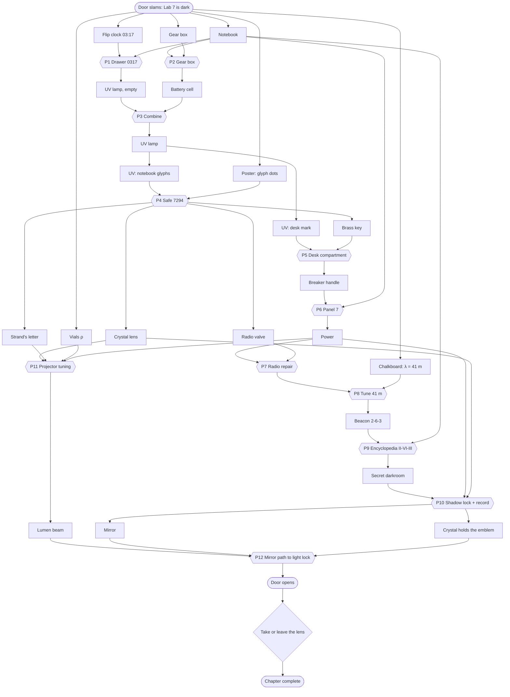

# Puzzle Design — Chapter 1: The Locked Laboratory (Laboratory 7)

**Target:** 20–30 minutes for a first-time player, with 12 linked puzzles that grow steadily harder.

**Design rules:**
1. **Every solution is deduced from in-world evidence.** Nothing is random, there are no pixel hunts, and no tap does something unexplained.
2. **Every solution is language-neutral:** digits, symbols, colours, dot counts, pulses, Roman numerals, density numbers and shapes.
3. **No item can be lost.** An item is removed only when it is used correctly.
4. **Every mechanism is reversible or symmetric-tolerant.** No state can become unsolvable. The fuzz tests in `game/tests/` verify this.
5. **Parallel branches:**
   - Act A: drawer ∥ gear box.
   - Act B: safe ∥ desk compartment.
   - Act E: projector tuning ∥ mirror quest.
6. **Hints:** every step has a three-level ladder (nudge, then where to look, then the explicit answer).
7. **Accessibility:** colours also carry notches, sounds also show visual pulses and caption dots, and shapes are high-contrast.

## Acts & puzzles

| # | Act | Puzzle | Type | Evidence the player uses | Solution | Reward |
|---|---|---|---|---|---|---|
| P1 | A Darkness | **Desk drawer** | Observation | Flip clock stopped at 03:17. Notebook p.2: "I set the drawer to the moment every clock stopped" | Wheels `0 3 1 7` | UV lamp (empty) |
| P2 | A | **Strand's gear box** | Mechanical | Notebook p.3: "turn one wheel and its neighbour follows". Each knob *i* turns gear *i* and gear *(i+1) mod 3* one step out of 6. Start A=1, B=3, C=2 | All pointers to the back mark (minimum A×2, B×1, C×3) | Battery cell |
| P3 | A | **Lamp assembly** | Combination | Lamp has an empty cell bay | UV lamp + cell | Working UV lamp |
| P4 | B Hidden ink | **Cipher → safe** | Hidden info + decoding | UV on the blank notebook page shows `sun · wave · spiral · delta`. The poster *Tabula Resonantiarum* gives each glyph a dot count | Keypad `7 2 9 4` | Brass key, crystal lens, Strand's letter, radio valve |
| P5 | B | **Desk secret compartment** | Hidden info + key | Notebook p.6 "where only my lamp can show the way". UV reveals a circle and arrow on the desk side at the rosette. Press the rosette and a keyhole appears | Brass key in the keyhole | Breaker handle + Leyla's photograph (story) |
| P6 | C Power | **Panel 7 circuits** | Logic | Notebook p.4: LOCK, LIGHT, ARRAY live; VENT dead. The engraved traces show which lamps each switch feeds | Main lever ON with lamps L, G, A on and V off. The wiring is drawn per game from a pool of 8 (docs/VARIANTS.md); the canonical one takes I+II+III or I+V. VENT live trips the breaker safely | Power: lights on, radio and the darkroom lamp live, projector hums |
| P7 | C | **Radio repair** | Instrument repair | Radio hatch shows an empty valve socket. The valve came from the safe | Insert the valve | Radio works |
| P8 | C Signals | **Beacon tuning** | Sound / radio frequency | Chalkboard: antenna doodle with a circled "λ = 41 m". The dial has wavelength bands. As you approach the band, static turns into a signal (audio and the magic-eye glow) | Dial on the 41 m band (value 36 ± 2) | Signal: pulses `•• / •••••• / •••` repeating (2-6-3), with blinking lamp and caption dots |
| P9 | D Secrets | **Encyclopedia door** | Code application | Notebook p.8: "the beacon repeats three numbers; my encyclopedia remembers them". Volumes I–IX on the shelf | Pull II → VI → III | Bookcase swings open: secret darkroom |
| P10 | D | **Shadow lock + Light Memory (M1)** | Light & shadow (spatial) + recording | The darkroom wall has the Institute emblem (ring + meridian) with a brass socket at its centre. A lamp throws the real-time shadow of a brass ring and rod sculpture onto it. Darkroom note: "Only light and shadow may draw the Institute's mark. The crystal remembers what falls on it" | Ring facing the lamp **and** rod vertical (each has 6 positions of 30°; only one is aligned). The cabinet opens. With the **crystal lens seated in the socket** while the shadow is aligned, the crystal **records the emblem** | Round mirror + crystal holding the emblem |
| P11 | E Light | **Lumen projector tuning (M2)** | Deduction | Strand's letter: "three rings sing with the three samples, the heaviest first". Vials ρ: crimson 1.84, cobalt 1.26, green 0.79 | Insert the lens. Rings: crimson, cobalt, green. Pull the lever | A sustained Lumen beam that carries whatever the crystal recorded |
| P12 | E | **Mirror path → light lock (M1 + M2)** | Light & mirrors | The door has a ground-glass **light lock**. Leyla p.7: "the door's eye opens only for the Institute's mark in Lumen light". Stand A has a mirror; stand B has an empty bracket. The beam is visible live | Mount the mirror on B. Rotate A to 225° (north) and B to 45° (east) so the beam lands on the lock **carrying the recorded emblem** | Maglock releases; the door opens; **the room flashes back to 1979** |
| — | Finale | **Choice** | Narrative choice | Leyla's light-echo appears at the desk and looks at you | *Take the lens* or *Leave it for her* | Ending variant, stored for Chapter 2 |
| ★ | Optional | **5 Lumen shards** | Exploration | Invisible except under UV: under the desk, on top of the bookcase, behind the radiator, in the coat pocket, in the darkroom | Collect all 5 | Secret epilogue line + "Light Remembers" achievement |

### Data tables

**P6 switch matrix** (✓ = the switch toggles that lamp):

| Switch | LOCK | LIGHT | ARRAY | VENT |
|---|:-:|:-:|:-:|:-:|
| I | ✓ | | | ✓ |
| II | | ✓ | | |
| III | | | ✓ | ✓ |
| IV | ✓ | ✓ | | |
| V | | ✓ | ✓ | ✓ |

The kernel is {II, III, V}, so exactly two switch sets solve it: {I, II, III} and {I, V}.

This is the canonical wiring (entry 0 of `Lab7Logic.PANEL_POOL`). Every game draws one of 8 wirings, each with rank 4 and exactly two answers; see docs/VARIANTS.md.

**P4 glyph dots:**

| Glyph | Dots |
|---|---|
| sun | 7 |
| crescent | 3 |
| wave | 2 |
| spiral | 9 |
| delta | 4 |
| eye | 0 |
| cross | 5 |
| diamond | 1 |
| fork | 8 |
| hourglass | 6 |

**P8 radio dial bands** (dial value → band):

| Value | Band |
|---|---|
| 5 | 60 m |
| 20 | 49 m |
| **36** | **41 m** |
| 55 | 31 m |
| 72 | 25 m |
| 86 | 19 m |
| 96 | 16 m |

The dial starts at 80, and the signal is clear within ±2 of 36.

**P11 ring colours:** crimson, amber, green, cobalt, violet, white (index 0..5). All rings start on white.

**P12 mirror geometry** (plan view, x east, z south; beam height 1.15 m):
- Projector P(−2.3, 1.6) emits toward +X.
- A(1.6, 1.6) needs normal 225°, which is rotation index 5 at 45° steps. It starts at 0 and only its back is hit.
- B(1.6, 0.12) needs normal 45°, rotation index 1. It starts at 4 once mounted.
- Sensor S(2.97, 0.12).
- The mirrors are single-sided (brass back), so a beam that hits a back is absorbed.

## Dependency graph

## Hint ladder

The hint system shows the first unmet goal whose prerequisites are met:

| Goal | Condition | 1 · Nudge | 2 · Where | 3 · Answer |
|---|---|---|---|---|
| H1 drawer | drawer closed | Leyla wrote about a moment she must never forget. | The clock on her desk stopped at that moment. | Set the drawer wheels to 0-3-1-7. |
| H2 gear box | box closed | Strand's box: each knob drags a neighbour. | Bring every gear's pointer to the mark at the back. | Press the left knob 2×, the middle 1×, the right 3×. |
| H3 lamp | lamp + cell, not combined | The lamp is dead. | Its bay fits something you carry. | Select the lamp, press Combine, tap the battery cell. |
| H4 cipher | UV works, page not revealed | One notebook page looks empty. | Shine the UV lamp on it. | Open the notebook at the blank page and press the UV button. |
| H5 safe | page revealed, safe closed | The symbols stand for numbers. | The poster counts dots for each symbol. | The code is 7-2-9-4. |
| H6 compartment | safe open, keyhole hidden | "Where only my lamp can show the way." | Shine the UV lamp along the desk. | UV the desk's right side, then press the carved rosette. |
| H7 key | keyhole shown, compartment closed | A keyhole needs a key. | The safe held a small brass key. | Use the brass key on the desk keyhole. |
| H8 handle | have handle, not installed | The main breaker can't be moved. | Its handle is missing. | Use the breaker handle on Panel 7's main lever. |
| H9 circuits | handle installed, no power | Leyla listed which lines must be live. | LOCK, LIGHT, ARRAY on; VENT off. Follow the copper traces. | Raise only the switches of this game's shortest answer (canonical wiring: I, V), then the main lever. |
| H10 valve | power, valve not installed | The radio is silent. | Open its hatch: a valve is missing. | Use the radio valve from the safe on the radio's socket. |
| H11 tune | radio works, not tuned | Strand left his beacon's band on the board. | The chalkboard says λ = 41 m. The dial has metre bands. | Turn the dial to the 41 m band. |
| H12 books | signal heard, shelf closed | The beacon repeats three numbers. | Count its pulses: 2, 6, 3. Leyla's encyclopedia listens. | Pull volumes II, VI, then III. |
| H13 shadow | darkroom open, cabinet closed | The wall shows the Institute's mark. | Make the sculpture's shadow draw it: a full ring and a straight line. | Turn the ring until it faces the lamp, and the rod until it is upright. |
| H13b record | cabinet open, emblem not recorded | "The crystal remembers what falls on it." | The emblem has a socket at its centre that fits the crystal lens. | Put the crystal lens in the emblem socket while the shadow forms the emblem. |
| H14 lens | lens not installed (after power) | The projector's socket is empty. | The crystal lens fits it. | Use the crystal lens on the projector. |
| H15 tune | lens in, beam off | Strand's letter tells how to tune it. | Heaviest first. Compare the vials' ρ. | Rings: crimson, cobalt, green. Then pull the lever. |
| H16 mirrors | beam on, door closed | The door has a glass eye made for light. | Mount the round mirror on the empty stand. Turn the mirrors to guide the beam. | First stand: turn the mirror until the beam goes toward the window wall. Second stand: send the beam to the door's eye. |
| H17 key image | beam reaches lock, emblem not recorded | The door's eye waits for a sign, not plain light. | The crystal must carry the Institute's mark. | Record the emblem in the darkroom (lens in the socket, shadow aligned), then fire the projector again. |

## Softlock analysis
- **Items:** they are never consumed by a wrong action, never dropped and never destroyed.
- **Reversible mechanisms:**
  - The drawer wheels, keypad, gear box (a cyclic group action), switches, radio dial, rings, sculpture and mirrors are all reversible.
  - The book sequence uses the last three pulls, so the player can always retry.
- **Breaker trip:** it resets only the main lever.
- **Locked-in successes:** after power is restored the switches lock. The beam stays on until the lens is removed. The lens can **always** be taken back out of the projector or the emblem socket, which turns the beam off and unlocks the rings. A recorded emblem is never lost.
- **Saves:** only ids and numbers are stored, so saves do not depend on language. The save version field and defaults keep them forward-compatible.
- **Automated proof:** random action sequences (many seeds × thousands of steps) are run, and then a scripted solver must still reach `chapter_complete`.
